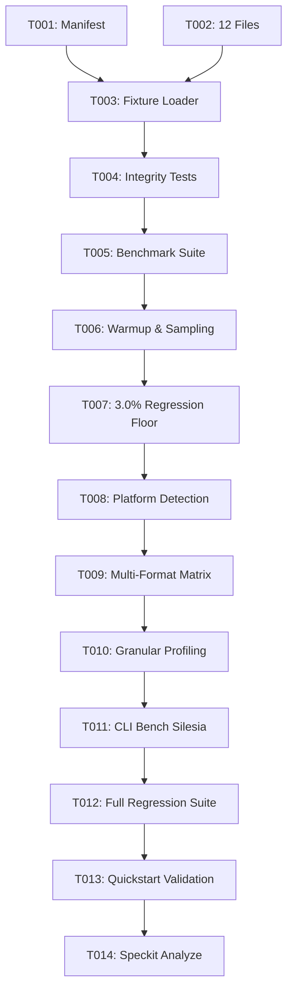

# Tasks: Silesia Corpus Standard Benchmark Fixtures & Regression Gates

**Feature**: Silesia Corpus Standard Benchmark Fixtures & Regression Gates
**Branch**: `049-silesia-corpus-benchmark`
**Spec**: [spec.md](file:///Users/kevintung/Documents/dev/TTZip/specs/049-silesia-corpus-benchmark/spec.md) | **Plan**: [plan.md](file:///Users/kevintung/Documents/dev/TTZip/specs/049-silesia-corpus-benchmark/plan.md)

---

## Phase 1: Setup (Shared Infrastructure)

**Purpose**: Establish physical fixture assets and metadata manifest under `Tests/TTZipTests/Fixtures/Silesia/`.

- [x] T001 Create Silesia fixture manifest file in `Tests/TTZipTests/Fixtures/Silesia/silesia_manifest.json`
- [x] T002 [P] Populate all 12 Silesia standard uncompressed corpus files in `Tests/TTZipTests/Fixtures/Silesia/`

---

## Phase 2: Foundational (Blocking Prerequisites)

**Purpose**: Core zero-copy fixture loading and cryptographic integrity verification prerequisites.

**⚠️ CRITICAL**: All user stories depend on this foundational fixture loader and integrity check.

- [x] T003 [P] Implement `SilesiaFixtureLoader` with 3-tier fallback resolution (`Bundle.module` / `TTZIP_SILESIA_PATH` / `#filePath`) in `Tests/TTZipTests/SilesiaFixtureLoader.swift`
- [x] T004 [P] Implement `SilesiaCorpusIntegrityTests` asserting exact byte lengths and SHA-256 checksums in `Tests/TTZipTests/SilesiaCorpusIntegrityTests.swift`

**Checkpoint**: Foundation complete — all 12 corpus files are verified and loadable via zero-copy paths.

---

## Phase 3: User Story 1 - Standardized Real-World Performance Regression Gating (Priority: P1) 🎯 MVP

**Goal**: Execute automated compression/decompression benchmark loops with 3.0% regression floor gating.

**Independent Test**: Run `TTZIP_RUN_BENCHMARKS=1 swift test --filter SilesiaCorpusBenchmarkSuiteTests` and verify all tests pass with zero regression.

- [x] T005 [P] [US1] Create test suite structure in `Tests/TTZipTests/SilesiaCorpusBenchmarkSuiteTests.swift`
- [x] T006 [US1] Implement 1-warmup + 3-measurement sampling loop with $CV \le 2.5\%$ filtering in `Tests/TTZipTests/SilesiaCorpusBenchmarkSuiteTests.swift`
- [x] T007 [US1] Implement hard 3.0% throughput regression floor gating assertions against historical baseline in `Tests/TTZipTests/SilesiaCorpusBenchmarkSuiteTests.swift`

**Checkpoint**: User Story 1 complete — CI/CD performance regression floor is active and functional.

---

## Phase 4: User Story 2 - Cross-Platform Baseline & Cache-Jitter Immunity (Priority: P2)

**Goal**: Multi-format benchmark matrix execution (ZIP, 7Z, TAR.ZST, TAR.GZ, TAR.BZ2, TAR.XZ) with UMA/NTFS cache isolation.

**Independent Test**: Verify benchmark matrix across all primary archive formats using `IsolatedTempSandbox`.

- [x] T008 [P] [US2] Implement platform environment detection (Apple Silicon UMA vs x86/Windows) in `Tests/TTZipTests/SilesiaCorpusBenchmarkSuiteTests.swift`
- [x] T009 [US2] Add multi-format compression/decompression benchmark matrix tests in `Tests/TTZipTests/SilesiaCorpusBenchmarkSuiteTests.swift`

**Checkpoint**: User Story 2 complete — cross-format matrix executes with cache jitter immunity.

---

## Phase 5: User Story 3 - Granular Corpus Data-Type Profiling & Anomaly Diagnostics (Priority: P3)

**Goal**: Detailed per-file diagnostics and CLI bench command integration.

**Independent Test**: Execute `swift run ttzip-cli bench --silesia --format zip --json` and verify granular per-file breakdown.

- [x] T010 [P] [US3] Implement granular 12-file metric record formatting and console table rendering in `Tests/TTZipTests/SilesiaCorpusBenchmarkSuiteTests.swift`
- [x] T011 [US3] Add `--silesia` option support to CLI benchmark command in `Sources/TTZipCLI/BenchmarkCommand.swift`

**Checkpoint**: User Story 3 complete — granular per-file entropy profiling is available via CLI and test output.

---

## Phase 6: Polish & Quality Gates

**Purpose**: End-to-end verification, consistency checks, and documentation synchronization.

- [x] T012 Run full regression test suite via `swift test` and confirm 0 regressions
- [x] T013 [P] Execute quickstart scenarios in `specs/049-silesia-corpus-benchmark/quickstart.md`
- [x] T014 Execute `@speckit-analyze` cross-artifact consistency validation

---

## Dependencies & Execution Order

