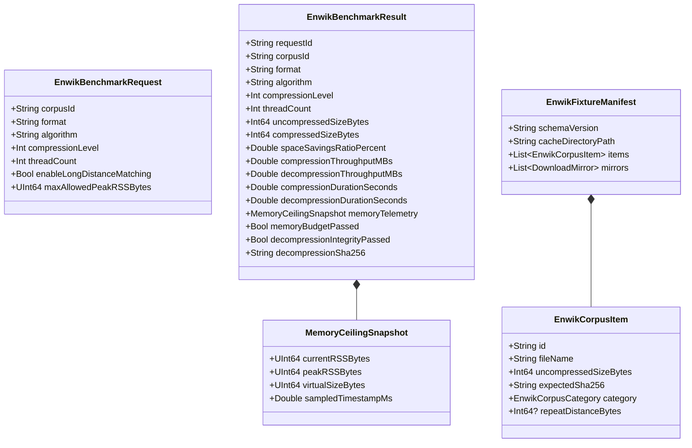

# Data Model: enwik8 / enwik9 Extreme Compression Benchmark

**Feature**: `050-enwik-extreme-compression-benchmark`
**Created**: 2026-08-17
**Status**: Ready

---

## 1. Entity Overview

---

## 2. Entity Definitions

### 2.1 `EnwikCorpusItem`
Represents an individual test corpus entry (e.g. `enwik8`, `enwik9`, or deterministic synthetic variation).

| Field | Type | Required | Description |
| :--- | :--- | :--- | :--- |
| `id` | `String` | Yes | Unique identifier (e.g., `"enwik8"`, `"enwik9"`, `"synthetic-1gb"`) |
| `fileName` | `String` | Yes | Local disk file name (e.g., `"enwik8.xml"`) |
| `uncompressedSizeBytes` | `Int64` | Yes | Exact uncompressed payload length in bytes ($10^8$ or $10^9$) |
| `expectedSha256` | `String` | Yes | 64-character lowercase hexadecimal SHA-256 fingerprint |
| `category` | `String (Enum)` | Yes | Enum: `"canonical-xml-wikipedia"` \| `"synthetic-structured-xml"` |
| `repeatDistanceBytes` | `Int64` | No | Configured long-distance pattern recurrence distance in bytes |

### 2.2 `MemoryCeilingSnapshot`
Captures zero-overhead kernel memory high-water mark and current resident metrics.

| Field | Type | Required | Description |
| :--- | :--- | :--- | :--- |
| `currentRSSBytes` | `UInt64` | Yes | Instantaneous resident set size in bytes |
| `peakRSSBytes` | `UInt64` | Yes | Lifetime peak resident set size (kernel high-water mark) in bytes |
| `virtualSizeBytes` | `UInt64` | Yes | Virtual memory address space allocation in bytes |
| `sampledTimestampMs` | `Double` | Yes | Epoch timestamp in milliseconds when telemetry was captured |

### 2.3 `EnwikBenchmarkRequest`
Defines the parameters and constraints for an individual benchmark run.

| Field | Type | Required | Description |
| :--- | :--- | :--- | :--- |
| `corpusId` | `String` | Yes | Target corpus identifier (`"enwik8"`, `"enwik9"`, etc.) |
| `format` | `String (Enum)` | Yes | Enum: `"7z"` \| `"zstd"` \| `"tar.zst"` \| `"tar.xz"` \| `"bzip2"` \| `"zip"` |
| `algorithm` | `String (Enum)` | Yes | Enum: `"lzma2"` \| `"zstd"` \| `"bzip2"` \| `"deflate"` |
| `compressionLevel` | `Int` | Yes | Compression level integer (e.g., 1 to 22) |
| `threadCount` | `Int` | Yes | Concurrency worker count ($\ge 1$) |
| `enableLongDistanceMatching` | `Bool` | Yes | Whether LDM / extra-large match finders are explicitly activated |
| `maxAllowedPeakRSSBytes` | `UInt64` | Yes | Maximum permissible peak RSS memory budget in bytes |

### 2.4 `EnwikBenchmarkResult`
Encapsulates the complete quantitative measurement outcome of a benchmark execution.

| Field | Type | Required | Description |
| :--- | :--- | :--- | :--- |
| `requestId` | `String` | Yes | UUID tracking the specific execution request |
| `corpusId` | `String` | Yes | Referenced corpus identifier |
| `format` | `String` | Yes | Archive format evaluated |
| `algorithm` | `String` | Yes | Compression algorithm evaluated |
| `compressionLevel` | `Int` | Yes | Applied compression level |
| `threadCount` | `Int` | Yes | Worker thread count utilized |
| `uncompressedSizeBytes` | `Int64` | Yes | Uncompressed raw byte count |
| `compressedSizeBytes` | `Int64` | Yes | Output archive byte count |
| `spaceSavingsRatioPercent` | `Double` | Yes | Calculated space reduction percentage: $(1 - \frac{\text{compressed}}{\text{uncompressed}}) \times 100\%$ |
| `compressionThroughputMBs` | `Double` | Yes | Compression speed in MB/s |
| `decompressionThroughputMBs`| `Double` | Yes | Decompression speed in MB/s |
| `compressionDurationSeconds`| `Double` | Yes | Wall-clock compression elapsed time in seconds |
| `decompressionDurationSeconds`| `Double`| Yes | Wall-clock decompression elapsed time in seconds |
| `memoryTelemetry` | `MemoryCeilingSnapshot` | Yes | Kernel memory telemetry recorded during pass |
| `memoryBudgetPassed` | `Bool` | Yes | `true` if `peakRSSBytes <= maxAllowedPeakRSSBytes` |
| `decompressionIntegrityPassed` | `Bool` | Yes | `true` if decompressed SHA-256 matches expected SHA-256 |
| `decompressionSha256` | `String` | Yes | Calculated SHA-256 checksum of decompressed output |

---

## 3. Consistency Matrix with JSON Contracts

| Swift Data Model Type | Contract Schema Path | Required Fields Match | Zero-Bare-Object Assertion |
| :--- | :--- | :--- | :--- |
| `EnwikCorpusItem` | `contracts/enwik-fixture-manifest.schema.json` | 100% | Verified (no `any` / no bare objects) |
| `MemoryCeilingSnapshot` | `contracts/memory-telemetry-snapshot.schema.json` | 100% | Verified |
| `EnwikBenchmarkRequest` | `contracts/enwik-benchmark-request.schema.json` | 100% | Verified |
| `EnwikBenchmarkResult` | `contracts/enwik-benchmark-result.schema.json` | 100% | Verified |
