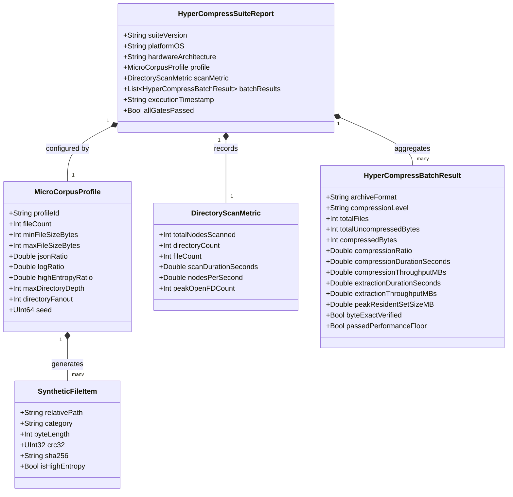

# Data Model: HyperCompressBench Benchmark Suite

**Feature Branch**: `051-hypercompress-bench-corpus`  
**Created**: 2026-08-17  
**Status**: Draft  
**Source Spec**: [spec.md](./spec.md)

---

## 1. Entity Overview

---

## 2. Entity Specifications

### 2.1 `MicroCorpusProfile`

Defines the generative parameters for synthesizing a reproducible micro-file dataset.

| Field | Type | Required | Description | Constraints |
| :--- | :--- | :--- | :--- | :--- |
| `profileId` | `String` | Yes | Unique identifier for the profile | e.g., `"ci-fast-gate"`, `"stress-50k"` |
| `fileCount` | `Int` | Yes | Total number of micro-files to generate | $500 \le \text{fileCount} \le 100,000$ |
| `minFileSizeBytes` | `Int` | Yes | Minimum byte size for generated files | $\ge 1$ byte (default: $1024$) |
| `maxFileSizeBytes` | `Int` | Yes | Maximum byte size for generated files | $\le 65536$ bytes (64KB) |
| `jsonRatio` | `Double` | Yes | Fraction of micro-JSON files | $0.0 \le r \le 1.0$ (default: $0.40$) |
| `logRatio` | `Double` | Yes | Fraction of server log files | $0.0 \le r \le 1.0$ (default: $0.40$) |
| `highEntropyRatio` | `Double` | Yes | Fraction of high-entropy binary files | $0.0 \le r \le 1.0$ (default: $0.20$) |
| `maxDirectoryDepth` | `Int` | Yes | Maximum directory nesting level | $1 \le \text{depth} \le 32$ |
| `directoryFanout` | `Int` | Yes | Target branch factor per directory | $2 \le \text{fanout} \le 100$ |
| `seed` | `UInt64` | Yes | Deterministic PRNG master seed | Default: `0x4879706572436F6D` |

---

### 2.2 `SyntheticFileItem`

Represents a single generated micro-file entity within the corpus hierarchy.

| Field | Type | Required | Description | Constraints |
| :--- | :--- | :--- | :--- | :--- |
| `relativePath` | `String` | Yes | Normalized relative path within corpus | Forward slashes, POSIX standard |
| `category` | `String` | Yes | Content category | Enum: `["json", "log", "binary"]` |
| `byteLength` | `Int` | Yes | Exact file size in bytes | $0 \le \text{byteLength} \le 65536$ |
| `crc32` | `UInt32` | Yes | IEEE 802.3 CRC32 checksum | Precomputed during generation |
| `sha256` | `String` | Yes | 64-character lowercase hex SHA-256 | Cryptographic integrity anchor |
| `isHighEntropy` | `Bool` | Yes | Whether payload is uncompressible | True for binary category |

---

### 2.3 `DirectoryScanMetric`

Captures the performance and VFS telemetry of filesystem directory traversal.

| Field | Type | Required | Description | Constraints |
| :--- | :--- | :--- | :--- | :--- |
| `totalNodesScanned` | `Int` | Yes | Count of visited directories and files | $\ge 0$ |
| `directoryCount` | `Int` | Yes | Number of visited directories | $\ge 0$ |
| `fileCount` | `Int` | Yes | Number of discovered regular files | $\ge 0$ |
| `scanDurationSeconds` | `Double` | Yes | Elapsed wall time in seconds | $> 0.0$ |
| `nodesPerSecond` | `Double` | Yes | Traversal throughput (nodes/sec) | $\ge 0.0$ |
| `peakOpenFDCount` | `Int` | Yes | High watermark of open file descriptors | $\le 128$ under standard quotas |

---

### 2.4 `HyperCompressBatchResult`

Encapsulates compression and decompression metrics for a format under batch micro-file workloads.

| Field | Type | Required | Description | Constraints |
| :--- | :--- | :--- | :--- | :--- |
| `archiveFormat` | `String` | Yes | Target archive format | Enum: `["zip", "7z", "tar.zst", "tar.gz", "tar.xz"]` |
| `compressionLevel` | `String` | Yes | Level specifier | e.g., `"fast"`, `"default"`, `"ultra"` |
| `totalFiles` | `Int` | Yes | Number of compressed files | $\ge 500$ |
| `totalUncompressedBytes` | `Int` | Yes | Sum of original file sizes | $\ge 0$ |
| `compressedBytes` | `Int` | Yes | Output archive size in bytes | $\ge 0$ |
| `compressionRatio` | `Double` | Yes | Compressed / Uncompressed ratio | $0.0 \le \text{ratio} \le 2.0$ |
| `compressionDurationSeconds` | `Double` | Yes | Elapsed compression time in seconds | $> 0.0$ |
| `compressionThroughputMBs` | `Double` | Yes | Raw compression throughput in MB/s | Must meet floor ($\ge 70$ Release) |
| `extractionDurationSeconds` | `Double` | Yes | Elapsed extraction time in seconds | $> 0.0$ |
| `extractionThroughputMBs` | `Double` | Yes | Decompression throughput in MB/s | $\ge 0.0$ |
| `peakResidentSetSizeMB` | `Double` | Yes | Peak RSS during batch operation in MB | Bounded micro-buffering |
| `byteExactVerified` | `Bool` | Yes | Whether 100% extracted hashes match | Must be `true` |
| `passedPerformanceFloor` | `Bool` | Yes | Whether all throughput floors are met | Must be `true` |

---

### 2.5 `HyperCompressSuiteReport`

Aggregates all execution results across directory scan and batch compression for release verification.

| Field | Type | Required | Description | Constraints |
| :--- | :--- | :--- | :--- | :--- |
| `suiteVersion` | `String` | Yes | Benchmark schema version | Semantic version (e.g., `"1.0.0"`) |
| `platformOS` | `String` | Yes | Operating system and kernel version | e.g., `"macOS 14.6 (Sonoma)"`, `"Windows 11"` |
| `hardwareArchitecture` | `String` | Yes | Host CPU architecture | e.g., `"arm64 (Apple M3 Max)"`, `"x86_64"` |
| `profile` | `MicroCorpusProfile` | Yes | Generator configuration used | Full profile entity |
| `scanMetric` | `DirectoryScanMetric` | Yes | Traversal benchmark result | Full scan metric entity |
| `batchResults` | `Array<HyperCompressBatchResult>` | Yes | Per-format benchmark records | Non-empty list |
| `executionTimestamp` | `String` | Yes | ISO 8601 UTC execution timestamp | e.g., `"2026-08-17T04:38:00Z"` |
| `allGatesPassed` | `Bool` | Yes | Overall gate validation verdict | `true` if all assertions pass |
