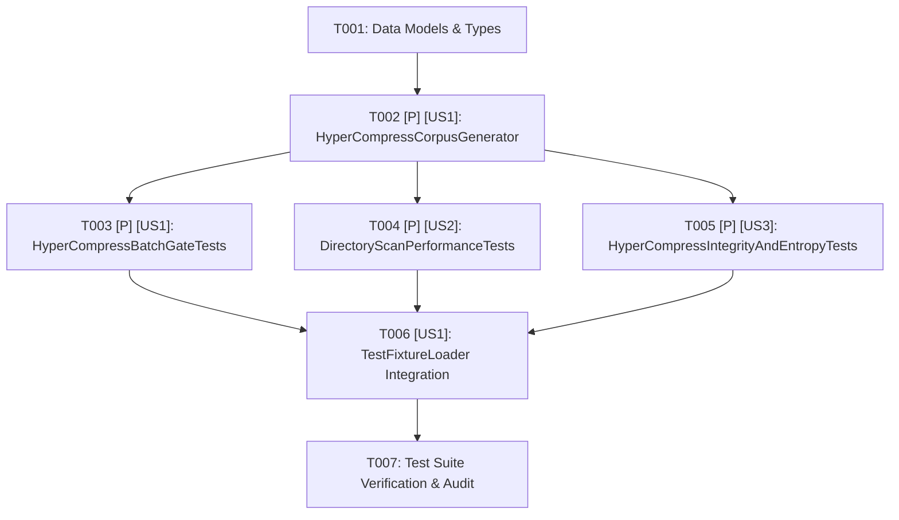

# Task List: HyperCompressBench Benchmark Suite

**Feature Branch**: `051-hypercompress-bench-corpus`  
**Created**: 2026-08-17  
**Status**: Completed  
**Source Spec**: [spec.md](./spec.md) | **Plan**: [plan.md](./plan.md)

---

## Task Dependencies & Flow

---

## Phase 1: Setup & Foundational Data Models

- [x] T001 Define `HyperCompressDataModels` struct types (`MicroCorpusProfile`, `SyntheticFileItem`, `DirectoryScanMetric`, `HyperCompressBatchResult`, `HyperCompressSuiteReport`) in `Tests/TTZipTests/HyperCompressCorpusGenerator.swift`

---

## Phase 2: User Story 1 - Micro-File Batch Compression Fast-Path & Floor Gating (Priority: P1)

- [x] T002 [P] [US1] Implement deterministic PRNG (SplitMix64/XorShift128+) generator supporting Micro-JSON (40%), Server Logs (40%), and High-Entropy Blobs (20%) at >= 1500 MB/s in `Tests/TTZipTests/HyperCompressCorpusGenerator.swift`
- [x] T003 [P] [US1] Implement `HyperCompressBatchGateTests` asserting >= 50 MB/s (Debug) / >= 70 MB/s (Release) on 500+ micro-files across ZIP, TAR.ZST, and 7Z in `Tests/TTZipTests/HyperCompressBatchGateTests.swift`

---

## Phase 3: User Story 2 - Cross-Platform High-Concurrency Directory Traversal & VFS Immunity (Priority: P2)

- [x] T004 [P] [US2] Implement `DirectoryScanPerformanceTests` verifying 1,000 nodes <= 10ms, 10,000 nodes <= 60ms, and 50,000 nodes <= 250ms traversal speed with <= 128 open FDs in `Tests/TTZipTests/DirectoryScanPerformanceTests.swift`

---

## Phase 4: User Story 3 - Mixed-Entropy Handling & Match-Finder Early-Exit Validation (Priority: P3)

- [x] T005 [P] [US3] Implement `HyperCompressIntegrityAndEntropyTests` verifying match-finder early-exit speedup on high-entropy data and 100% round-trip CRC32/SHA-256 hash match in `Tests/TTZipTests/HyperCompressIntegrityAndEntropyTests.swift`

---

## Phase 5: Integration & Verification

- [x] T006 [US1] Integrate `HyperCompressCorpusGenerator` access helper into `TestFixtureLoader.swift` in `Tests/TTZipTests/TestFixtureLoader.swift`
- [x] T007 [US1] Execute full test regression pass and verify all HyperCompress gates pass in `Tests/TTZipTests/`
