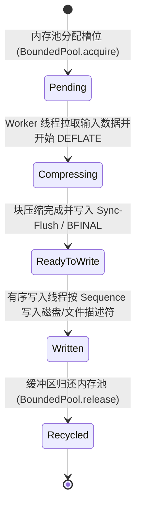

# Data Model Specification: Full-Matrix libdeflate Architecture

**Feature Directory**: `specs/053-chunked-deflate-compressor`
**Created**: 2026-08-17
**Status**: Completed

---

## 1. 实体定义 (Entity Definitions)

### 1.1 `ChunkedCompressionOptions`
负责定义分块流式压缩器的初始化与运行时超参数。

| 字段名 | 类型 | 必填 | 默认值 / 约束 | 语义说明 |
| :--- | :--- | :--- | :--- | :--- |
| `chunkSize` | `integer` | 是 | `1048576` (1MB) | 单个数据块的未压缩字节尺寸，必须为 64KB 对齐 |
| `maxInFlightChunks` | `integer` | 是 | `32` | 管道中处于读取、压缩、等待落盘状态的最大数据块槽位数（决定 $\le 64\text{MB}$ 内存确界） |
| `compressionLevel` | `integer` | 是 | `6` (范围 1 ~ 12) | `libdeflate` 压缩级别 |
| `enableZip64` | `boolean` | 是 | `false` | 是否显式强制开启 ZIP64，当未压缩文件大小 $\ge 4\text{GB}$ 时自动被引擎置为 `true` |
| `enableStoredBlockSync` | `boolean` | 是 | `true` | 是否在分块尾部注入 RFC 1951 `0x00 0x00 0xFF 0xFF` 字节对齐空存储块 |

---

### 1.2 `StreamChunkDescriptor`
代表流水线中流转的单一切片生命周期与内存状态。

| 字段名 | 类型 | 必填 | 约束 | 语义说明 |
| :--- | :--- | :--- | :--- | :--- |
| `sequenceNumber` | `integer` | 是 | $\ge 0$ 单调递增 | 数据块在全局流中的顺序索引，用于写端严格保序 |
| `uncompressedSize` | `integer` | 是 | $1 \dots 1048576$ 字节 | 该块实际的未压缩有效载荷长度 |
| `compressedSize` | `integer` | 是 | $\ge 0$ | 该块经 DEFLATE 压缩后的字节长度 |
| `chunkCrc32` | `integer` | 是 | 32-bit 无符号整数 | 该块独立的 CRC-32 校验和（用于并行增量校验） |
| `isFinalChunk` | `boolean` | 是 | `true` / `false` | 是否为文件的最后一个数据块（决定 `BFINAL` 位与流终结符） |
| `state` | `string` | 是 | 枚举: `pending`, `compressing`, `ready_to_write`, `written`, `recycled` | 槽位生命周期状态 |

---

### 1.3 `PlatformBuildManifest`
代表跨平台构建系统的构建配置与架构产物元数据。

| 字段名 | 类型 | 必填 | 约束 | 语义说明 |
| :--- | :--- | :--- | :--- | :--- |
| `targetPlatform` | `string` | 是 | 枚举: `macos_universal2`, `windows_x86_64`, `windows_arm64` | 目标操作系统与架构 |
| `libdeflateVersion` | `string` | 是 | 正则: `^v[0-9]+\.[0-9]+(\.[0-9]+)?$` | 构建集成的 libdeflate 官方标签版本（如 `v1.22`） |
| `compiler` | `string` | 是 | 枚举: `apple_clang`, `msvc`, `clang_cl` | 使用的 C 编译器工具链 |
| `simdExtensions` | `array of string` | 是 | 元素为 `armv8.2-a+crypto`, `avx2`, `bmi2`, `neon` | 激活的硬件指令集扩展 |
| `artifactPath` | `string` | 是 | 非空字符串 | 静态库输出物理相对路径 |

---

## 2. 状态机迁移图 (State Machine Transitions)

---

## 3. 双向一致性断言 (Bidirectional Consistency Assertions)

- `ChunkedCompressionOptions` $\leftrightarrow$ [`contracts/chunked_pipeline_options.json`](file:///Users/kevintung/Documents/dev/TTZip/specs/053-chunked-deflate-compressor/contracts/chunked_pipeline_options.json)
- `StreamChunkDescriptor` $\leftrightarrow$ [`contracts/chunk_stream_event.json`](file:///Users/kevintung/Documents/dev/TTZip/specs/053-chunked-deflate-compressor/contracts/chunk_stream_event.json)
- `PlatformBuildManifest` $\leftrightarrow$ [`contracts/cross_platform_build_manifest.json`](file:///Users/kevintung/Documents/dev/TTZip/specs/053-chunked-deflate-compressor/contracts/cross_platform_build_manifest.json)
- **禁止裸对象**：所有契约模式严格定义全部属性并设置 `additionalProperties: false`，杜绝任何 `type: "object"` 占位。
