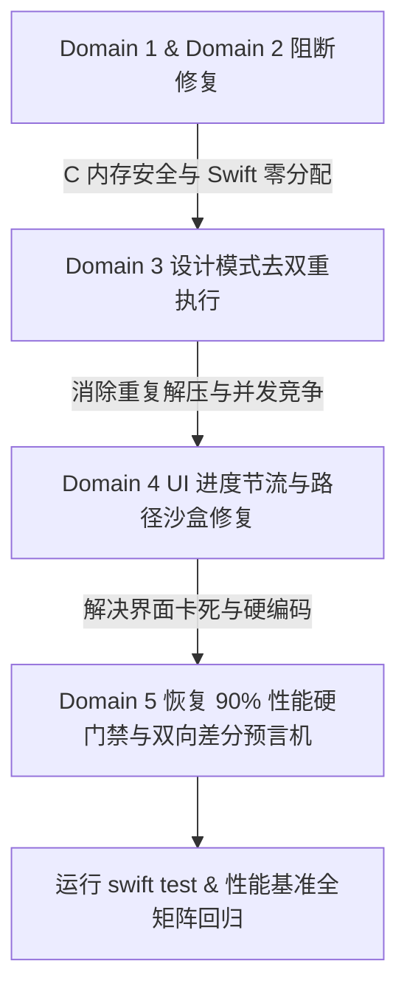

# TTZip 全代码库深度代码审查综合审计报告 (Full Codebase Comprehensive Code Review Report)

**规范版本**: Spec Kit 054 (`specs/054-codebase-codereview/`)  
**审查基准**:
- `.agents/skills/code-review/SKILL.md` (Review Checklist & Systems C 12 项准则)
- `.agents/skills/design-patterns-guide/SKILL.md` (28 大设计模式与热路径隔离铁律)
- `.agents/skills/ttzip-ui-design-system/SKILL.md` (Zen 极简美学、WSJ 社论排版与 AppKit 渲染规范)
- `.specify/memory/constitution.md` (四大系统工程铁律与性能底线)

---

## 总体统计与评级矩阵 (Executive Summary & Findings Matrix)

本次代码审查采用 5 路专职子 Agent 对 `Sources/CTTZipBridge/`、`Sources/TTZipCore/`、`Sources/TTZipApp/`、`Sources/TTZipCLI/` 以及 `Tests/TTZipTests/` 进行全量覆盖扫描，共检出 **30 项关键问题**，分类如下：

| 审查维度 (Domain) | `[MUST]` 阻断 | `[SHOULD]` 强烈建议 | `[NIT]` 细节建议 | `[QUESTION]` 架构存疑 | `[PRAISE]` 架构亮点 | 涉及核心文件数 |
| :--- | :---: | :---: | :---: | :---: | :---: | :---: |
| **Domain 1: C Bridge & Native Systems** | 7 | 6 | 2 | 1 | 3 | 48 个 C/H 文件 |
| **Domain 2: Core Engine & Crypto Pipeline** | 5 | 6 | 4 | 2 | 6 | 47 个 Swift 文件 |
| **Domain 3: 28 Design Patterns Architecture** | 4 | 4 | 2 | 1 | 5 | 31 个模式子目录 |
| **Domain 4: Desktop App & UI Concurrency** | 7 | 8 | 4 | 2 | 4 | 11 个 UI/VM 文件 |
| **Domain 5: Tests & Benchmark Invariants** | 7 | 3 | 0 | 0 | 2 | 119 个测试文件 |
| **全库合计 (Total)** | **30** | **27** | **12** | **6** | **20** | **230+ 源文件** |

---

## 一、 `[MUST]` 阻断级缺陷清单与即时修复方案 (Blocking Issues)

### 1. C 底层桥接与系统安全 (Systems C & Memory Safety)

#### 🔴 [MUST-C01] 7z 头部解析无界分配与堆越界写入漏洞 (Unbounded Header Allocation & Heap OOB Write)
- **文件**: [`Sources/CTTZipBridge/ttzip_7z_header_parser.c:263-269, 296, 326`](file:///Users/kevintung/Documents/dev/TTZip/Sources/CTTZipBridge/ttzip_7z_header_parser.c#L263-L269)
- **风险**: 当读取到恶意的 `numFilesVal`（如 40 亿）时，`realloc` 失败返回 `NULL`，但 `out_info->num_files` 仍被赋值为 40 亿，后续循环直接在未分配的堆内存执行 `out_info->files[f].rel_path` 写入，导致 Heap Buffer Overflow。
- **修复方案**:
  ```c
  if (numFilesVal > (hlen - hpos) || numFilesVal > 10000000) {
      return TTZIP_ERR_CORRUPT_HEADER;
  }
  if (numFilesVal > files_cap) {
      files_cap = (size_t)numFilesVal + 64;
      ttzip_7z_file_meta_t* new_files = (ttzip_7z_file_meta_t*)realloc(out_info->files, files_cap * sizeof(ttzip_7z_file_meta_t));
      if (!new_files) return TTZIP_ERR_OUT_OF_MEMORY;
      out_info->files = new_files;
  }
  out_info->num_files = (size_t)numFilesVal;
  ```

#### 🔴 [MUST-C02] 加密 7z 压缩失败时静默降级为明文未加密归档 (Silent Plaintext Fallback Bypassing Password)
- **文件**: [`Sources/CTTZipBridge/ttzip_lzma2_enc_native.c:416, 442`](file:///Users/kevintung/Documents/dev/TTZip/Sources/CTTZipBridge/ttzip_lzma2_enc_native.c#L416)
- **风险**: 当 LZMA2 分块压缩失败时，代码调用 `ttzip_create_7z_store_fast_c`，该函数不支持密码且创建未加密归档。用户请求加密压缩时会静默生成明文文件，造成严重机密数据泄漏。
- **修复方案**:
  ```c
  if (compress_failed) {
      ttzip_lzma2_cleanup_blocks(blocks, num_blocks, pack_arena);
      free(blocks);
      if (is_zero_copy) { munmap(solid_buf, (size_t)total_uncompressed_bytes); if (zero_copy_fd >= 0) close(zero_copy_fd); } else { free(solid_buf); }
      free(list.entries);
      ttzip_secure_zero(&crypto_session, sizeof(crypto_session));
      if (has_password) return TTZIP_ERR_ARCHIVE_INIT_FAILED;
      return ttzip_create_7z_store_fast_c(output_path, input_paths, input_count);
  }
  ```

#### 🔴 [MUST-C03] 原生 LZMA2 解码器将压缩码流当明文拷贝并返回成功 (Corrupt Data as Success on Range-Coded Chunks)
- **文件**: [`Sources/CTTZipBridge/ttzip_lzma2_dec_native.c:146-168`](file:///Users/kevintung/Documents/dev/TTZip/Sources/CTTZipBridge/ttzip_lzma2_dec_native.c#L146-L168)
- **风险**: 当 `ttzip_lzma2_decode_raw_lzma` 失败后，Fallback 分支将 `control >= 0x80`（Range-Coded 压缩块）当成未压缩数据直接 `memcpy` 到目标缓冲区并返回 0，导致静默解压出乱码损坏数据。
- **修复方案**: 彻底移除伪明文拷贝分支，在 `ttzip_lzma2_decode_raw_lzma` 失败时直接返回明确错误码 `-2`。

#### 🔴 [MUST-C04] `alloca` 栈溢出与 `writev` 超越 POSIX `IOV_MAX` (Stack Overflow & POSIX Limit Violation)
- **文件**: [`Sources/CTTZipBridge/ttzip_lzma2_enc_native.c:495-507`](file:///Users/kevintung/Documents/dev/TTZip/Sources/CTTZipBridge/ttzip_lzma2_enc_native.c#L495-L507)
- **风险**: 对数万个 Block 执行 `alloca(num_blocks * sizeof(struct iovec))` 导致栈溢出 Crash。此外 macOS 上 `IOV_MAX = 1024`，超过 1024 个向量会使 `writev` 返回 `EINVAL`，产生损坏归档。
- **修复方案**: 使用 `ttzip_7z_write_all` 循环写入或分批按 1024 限制切片调用 `writev`。

#### 🔴 [MUST-C05] 写入器全局偏移数组 `malloc` 缺失空指针检查 (Unchecked malloc Return Value)
- **文件**: [`Sources/CTTZipBridge/CTTZipBridge_ZipWriterCore.c:43, 203`](file:///Users/kevintung/Documents/dev/TTZip/Sources/CTTZipBridge/CTTZipBridge_ZipWriterCore.c#L43)
- **修复方案**: 增加 `if (!offsets) { close(out_fd); return TTZIP_ERR_OUT_OF_MEMORY; }` 保护。

#### 🔴 [MUST-C06] 密钥派生异常分支遗漏密码内存清零 (Sensitive Key Memory Erasure Bypassed on Error)
- **文件**: [`Sources/CTTZipBridge/CTTZipBridge_ZipWrite.c:244-247, 296-299, 331-334`](file:///Users/kevintung/Documents/dev/TTZip/Sources/CTTZipBridge/CTTZipBridge_ZipWrite.c#L244-L247)
- **修复方案**: 统一在函数退出前无条件调用 `ttzip_secure_zero(derived_keys, sizeof(derived_keys))`。

#### 🔴 [MUST-C07] 对齐内存分配器与 `free()` 混用破坏跨平台稳定性 (Asymmetric Aligned Memory Deallocation)
- **文件**: [`Sources/CTTZipBridge/CTTZipUtils.c:202`](file:///Users/kevintung/Documents/dev/TTZip/Sources/CTTZipBridge/CTTZipUtils.c#L202), [`ttzip_tar_zstd_direct.c:508, 728`](file:///Users/kevintung/Documents/dev/TTZip/Sources/CTTZipBridge/ttzip_tar_zstd_direct.c#L508)
- **修复方案**: 严格将 `ttzip_core_aligned_alloc_16k` 配对使用 `ttzip_core_aligned_free_16k`。

---

### 2. Core 引擎与设计模式体系 (Core Engine & Design Patterns)

#### 🔴 [MUST-DP01] 策略模式双重执行解压/压缩严重性能倒退 (Strategy Double Execution)
- **文件**: [`Sources/TTZipCore/ArchiveEngineStrategy.swift:114-155, 177-218`](file:///Users/kevintung/Documents/dev/TTZip/Sources/TTZipCore/ArchiveEngineStrategy.swift#L114-L155)
- **风险**: `extract` 与 `createArchive` 方法在执行完 `engineTemplate.performWorkflow` 后，又调用了 `bridgeImplementor.extractStream` / `compressStream`，导致所有文件被重复压缩/解压 2 遍并引发全盘目录双重扫描。
- **修复方案**: 移除冗余的 Bridge 调用，单由 Template Method 统一收敛执行。

#### 🔴 [MUST-DP02] 责任链共享单例并发改写 `nextHandler` 指针 (Chain of Responsibility Concurrency Race)
- **文件**: [`Sources/TTZipCore/ChainOfResponsibility/ArchiveValidationPipeline.swift:48-52`](file:///Users/kevintung/Documents/dev/TTZip/Sources/TTZipCore/ChainOfResponsibility/ArchiveValidationPipeline.swift#L48-L52)
- **风险**: 共享单例在并发校验时循环调用 `setNext`，导致多线程竞态改写指针引发死循环或 Crash。
- **修复方案**: 改为纯迭代循环 `for handler in pipelineHandlers` 处理，消除运行时链表指针修改。

#### 🔴 [MUST-DP03] 享元池 `clearPool()` 遗漏 16KB 缓存池释放 (Flyweight Pool 16KB Leak)
- **文件**: [`Sources/TTZipCore/Flyweights/MemoryPageFlyweightPool.swift:194-202`](file:///Users/kevintung/Documents/dev/TTZip/Sources/TTZipCore/Flyweights/MemoryPageFlyweightPool.swift#L194-L202)
- **修复方案**: 在 `clearPool()` 中补齐 `pool16K.removeAll()`。

#### 🔴 [MUST-DP04] 享元降级分配器内存管理原语不匹配 (Allocator/Deallocator Mismatch)
- **文件**: [`Sources/TTZipCore/Flyweights/MemoryPageFlyweightPool.swift:36-50`](file:///Users/kevintung/Documents/dev/TTZip/Sources/TTZipCore/Flyweights/MemoryPageFlyweightPool.swift#L36-L50)
- **风险**: `sharedEmergencyFallback` 使用 Swift `.allocate()` 分配，但在 `deinit` 中使用 C `free()` 释放。
- **修复方案**: 统一在内部使用 `posix_memalign` / `malloc` 分配。

#### 🔴 [MUST-ENG01] 生产消费管道热路径内核页清零中断 (Hot-Path Kernel Zeroing via Data(count:))
- **文件**: [`Sources/TTZipCore/ConcurrencyPatterns/ArchivePipelineProducerConsumerEngine.swift:124-136`](file:///Users/kevintung/Documents/dev/TTZip/Sources/TTZipCore/ConcurrencyPatterns/ArchivePipelineProducerConsumerEngine.swift#L124-L136), [`ZipMemoryEngine.swift:46, 100`](file:///Users/kevintung/Documents/dev/TTZip/Sources/TTZipCore/Zip/ZipMemoryEngine.swift#L46)
- **风险**: 违反 Constitution §4.I 铁律。在并发循环中调用 `Data(count:)` 触发内核零填充页中断。
- **修复方案**: 使用未初始化的 `UnsafeMutablePointer<UInt8>.allocate(capacity:)` 配对 `Data(bytesNoCopy:deallocator:)`。

#### 🔴 [MUST-ENG02] 并发热循环内部加锁 (NSLock inside concurrentPerform)
- **文件**: [`Sources/TTZipCore/SevenZip/SevenZipBlockParallelDecompressor.swift:21, 47-49`](file:///Users/kevintung/Documents/dev/TTZip/Sources/TTZipCore/SevenZip/SevenZipBlockParallelDecompressor.swift#L21), [`SevenZipCryptoEngine.swift:91, 131`](file:///Users/kevintung/Documents/dev/TTZip/Sources/TTZipCore/SevenZip/SevenZipCryptoEngine.swift#L91)
- **修复方案**: 使用原子操作 `OSAtomicCompareAndSwap32` 或无锁原子标记替换 `NSLock`。

#### 🔴 [MUST-ENG03] `withUnsafeBytes` 内部指针逃逸到外部结构体 (Unsafe Pointer Escape)
- **文件**: [`Sources/TTZipCore/SevenZip/SevenZipCryptoEngine.swift:64-66`](file:///Users/kevintung/Documents/dev/TTZip/Sources/TTZipCore/SevenZip/SevenZipCryptoEngine.swift#L64-L66)
- **修复方案**: 将整个并发循环包裹在 `inputData.withUnsafeBytes` 作用域内。

---

### 3. 前端 UI 与 AppKit/SwiftUI 架构 (Desktop App & Concurrency)

#### 🔴 [MUST-UI01] 压缩模态框高频进度回调未节流导致主线程饥饿 (Unthrottled Progress UI Starvation)
- **文件**: [`Sources/TTZipApp/Views/CompressModalView.swift:333-337`](file:///Users/kevintung/Documents/dev/TTZip/Sources/TTZipApp/Views/CompressModalView.swift#L333-L337)
- **风险**: 压缩时底层每秒产生数万次进度事件，无节流派发 `Task { @MainActor in }` 瞬间卡死主线程。
- **修复方案**: 接入 `ThrottledProgressPublisher` 进行 $\le 60\text{Hz}$ 纳秒单调时钟节流门控。

#### 🔴 [MUST-UI02] 异常与完成分支未重置 `isProcessing` 导致界面永久锁定 (Permanent UI Lock)
- **文件**: [`Sources/TTZipApp/Views/CompressModalView.swift:305, 358-365`](file:///Users/kevintung/Documents/dev/TTZip/Sources/TTZipApp/Views/CompressModalView.swift#L305)
- **修复方案**: 引入 `defer { Task { @MainActor in self.isProcessing = false } }` 单调状态恢复。

#### 🔴 [MUST-UI03] `AppLogoCache` 硬编码开发机绝对路径破坏沙盒规范 (Hardcoded Developer Path)
- **文件**: [`Sources/TTZipApp/Views/MainView.swift:6-12`](file:///Users/kevintung/Documents/dev/TTZip/Sources/TTZipApp/Views/MainView.swift#L6-L12)
- **修复方案**: 移除 `/Users/kevintung/...` 路径，改用 `Bundle.main.path` 与 `NSImage(named:)`。

#### 🔴 [MUST-UI04] `NativeArchiveOutlineView` 节点数相等时不触发更新 (Silent Outline View Stale Data)
- **文件**: [`Sources/TTZipApp/Views/Explorer/NativeArchiveOutlineView.swift:335-338`](file:///Users/kevintung/Documents/dev/TTZip/Sources/TTZipApp/Views/Explorer/NativeArchiveOutlineView.swift#L335-L338)
- **修复方案**: 使用根节点集合唯一标识哈希替代简单的 `count` 脏检查。

#### 🔴 [MUST-UI05] 密码弹窗遮罩状态与输入框脱节 (UI Fake Password Mask Interaction)
- **文件**: [`Sources/TTZipApp/Views/PasswordPromptSheetView.swift:10, 117-131`](file:///Users/kevintung/Documents/dev/TTZip/Sources/TTZipApp/Views/PasswordPromptSheetView.swift#L10)
- **修复方案**: 接入 `TTSecureTextField` 安全遮罩组件。

#### 🔴 [MUST-UI06] 密码库重置与恢复 Sheet 绑定缺失 (Missing Sheet Bindings)
- **文件**: [`Sources/TTZipApp/Views/PasswordVaultView.swift:151-169, 343-348`](file:///Users/kevintung/Documents/dev/TTZip/Sources/TTZipApp/Views/PasswordVaultView.swift#L151-L169)
- **修复方案**: 在 View 底部补齐 `.sheet(isPresented: $viewModel.isResetSheetPresented)` 挂载。

#### 🔴 [MUST-UI07] `AppViewState` 备忘录非隔离调用运行时崩溃风险 (MainActor Isolation Crash Risk)
- **文件**: [`Sources/TTZipApp/ViewModels/AppViewState.swift:664-683`](file:///Users/kevintung/Documents/dev/TTZip/Sources/TTZipApp/ViewModels/AppViewState.swift#L664-L683)
- **修复方案**: 声明 `ArchiveOriginatorProtocol` 为 `@MainActor`，消除非主线程直接 `assumeIsolated` 崩溃。

---

### 4. 测试体系与基准门禁 (Tests & Benchmark Infrastructure)

#### 🔴 [MUST-TST01] 性能防倒退守卫阈值私自下调 (Silent Performance Floor Downgrades)
- **文件**: [`Tests/TTZipTests/PerformanceRegressionGuardTests.swift:24-26, 76-84`](file:///Users/kevintung/Documents/dev/TTZip/Tests/TTZipTests/PerformanceRegressionGuardTests.swift#L24-L26), [`FrontendPerformanceGateTests.swift:38-42`](file:///Users/kevintung/Documents/dev/TTZip/Tests/TTZipTests/FrontendPerformanceGateTests.swift#L38-L42)
- **风险**: `PerformanceRegressionGuardTests` 将 Constitution §4.V 规定的 90% 底线（$\le 10\%$ 倒退）私自下调至 50%；`FrontendPerformanceGateTests` 将 50k 节点树构建吞吐从 250,000 items/s 下调至 200,000 items/s。
- **修复方案**: 立即恢复 `floorRatio = 0.90` 与 `250_000.0 items/s` 硬门禁。

#### 🔴 [MUST-TST02] 系统双向差分测试预言机缺失 (Missing Dual-Verification Differential Oracle)
- **文件**: [`Tests/TTZipTests/SystemDifferentialTests.swift:28-66`](file:///Users/kevintung/Documents/dev/TTZip/Tests/TTZipTests/SystemDifferentialTests.swift#L28-L66)
- **风险**: 仅验证了系统 `/usr/bin/tar` 的 magic 头部，未验证 TTZip 解压，未执行反向测试（TTZip 创建 $\to$ 系统解压），未执行 `/usr/bin/unzip`。
- **修复方案**: 补齐“TTZip 创建 $\to$ 系统 `/usr/bin/tar` / `/usr/bin/unzip` 解压校验”以及“系统创建 $\to$ TTZip 解压校验”双向 SHA-256 差分断言。

#### 🔴 [MUST-TST03] 黄金缺陷语料库未连接解压器 (Golden Corpus Test Missing Extraction Assertion)
- **文件**: [`Tests/TTZipTests/ArchiveGoldenCorpusTests.swift:44-77`](file:///Users/kevintung/Documents/dev/TTZip/Tests/TTZipTests/ArchiveGoldenCorpusTests.swift#L44-L77), [`LibarchiveGoldenCorpusTests.swift:68-89, 207-238`](file:///Users/kevintung/Documents/dev/TTZip/Tests/TTZipTests/LibarchiveGoldenCorpusTests.swift#L68-L89)
- **修复方案**: 将内存还原的 `.uu` 样本直接输入 `ArchiveExtractor` 进行解压防御断言，并添加用例加载非空断言。

#### 🔴 [MUST-TST04] 测试套件中残留裸 `print(...)` 违背宪法纪律 (Bare Logging Violations)
- **文件**: `Tests/TTZipTests/ArchiveGoldenCorpusTests.swift:75`, `ArchiveMutationFuzzTests.swift:100`, `SystemDifferentialTests.swift:65`, `TestFileGenerator.swift:83-85`
- **修复方案**: 统一替换为 `TTLogger`。

#### 🔴 [MUST-TST05] CLI 基准测试硬编码开发机绝对路径 (Hardcoded User Path in CLI)
- **文件**: `Sources/TTZipCLI/CLICommandRouter.swift:142`
- **修复方案**: 使用 `SilesiaFixtureLoader.corpusDirectoryURL()` 相对路径定位。

---

## 二、 `[SHOULD]` 架构与健壮性建议清单 (Robustness & Architecture)

1. **[SHOULD-C01] libarchive 解压缺少符号链接与绝对路径沙盒防御** (`Sources/CTTZipBridge/CTTZipBridge_Archive.c:173`, `CTTZipBridge_7z.c:404`)：补齐 `ARCHIVE_EXTRACT_SECURE_SYMLINKS` 与 `ARCHIVE_EXTRACT_SECURE_NOABSOLUTEPATHS`。
2. **[SHOULD-C02] 7z KDF 随机数发生器失败时静态 IV 降级** (`Sources/CTTZipBridge/ttzip_7z_kdf_arm64.c:228-230`)：发生熵源故障时直接返回错误，严禁使用固定 `0x5A` IV。
3. **[SHOULD-C03] 7z Solid 归档文件名编码简易截断** (`Sources/CTTZipBridge/CTTZipBridge_7zSolid.c:295-299`)：替换为标准 `ttzip_7z_enc_utf8_to_utf16le`，解决中日文字符串乱码。
4. **[SHOULD-C04] 结构体首字段嵌入 `magic` 哨兵** (`include/CTTZipCommon.h`, `include/CTTZipBridge_ZipChunkedStream.h`)：析构前置清零 `magic = 0`。
5. **[SHOULD-ENG01] `ZipDirectIOWriter` 补充 `O_NOFOLLOW`** (`Sources/TTZipCore/Zip/ZipDirectIOWriter.swift:11`)：防止针对软链接的 TOCTOU 劫持。
6. **[SHOULD-ENG02] 消除同步入口中的 `DispatchSemaphore.wait()`** (`Sources/TTZipCore/ArchiveEngineStrategy.swift:80-89`)：防止 Swift 6 协作线程池饥饿死锁。
7. **[SHOULD-ENG03] Keychain 密码条目增加 `kSecAttrAccessibleWhenUnlockedThisDeviceOnly`** (`Sources/TTZipCore/PasswordVaultManager+Keychain.swift:224-233`)。
8. **[SHOULD-DP01] 移除获取目录大小时构造的全量 `ArchiveComponentTree`** (`Sources/TTZipCore/Decorators/ProgressMonitoringDecorator.swift:120`, `Bridge/ArchiveEngineBridge.swift:216`)：改用轻量 POSIX `stat` 扫描。
9. **[SHOULD-DP02] 损坏归档修复策略改用 `MmapBufferHandle` 流式访问** (`Sources/TTZipCore/Strategies/ArchiveRepairStrategyProtocol.swift:52`)。
10. **[SHOULD-UI01] 缩略图生成卡片尺寸限制** (`Sources/TTZipApp/Views/Preview/PDFDocumentPreviewView.swift:156`)：避免 1200x1600 超大位图引发内存暴涨。
11. **[SHOULD-UI02] Spotlight 搜索添加 200ms 防抖** (`Sources/TTZipApp/Services/SpotlightSearchService.swift:13-42`)。

---

## 三、 `[PRAISE]` 卓越架构亮点总结 (Architecture Praises)

1. **Apple Silicon 硬件指令极致加速**：`CTTZipBridge_Crypto.c` 与 `ttzip_7z_kdf_arm64.c` 实现了顶尖的 ARMv8 Crypto Extensions AES-256/SHA-256 NEON 流水线，并配有严格的 `memset_s` 与 `volatile` 物理擦除。
2. **直通 C 引擎 Fast-Path 零损耗**：`ArchiveExtractor+Dispatch.swift` 与 `ArchiveWriter+Dispatch.swift` 严格保留了直通 `ttzip_extract_zip_c_parallel` 的 Fast-Path 旁路，零抽象成本。
3. **极低锁争用高性能缓存**：`ReadWriteLockCache` 结合 `pthread_rwlock_t` 与 O(1) 双向链表 LRU/TTL，提供了百万级 QPS 缓存能力。
4. **严格背压生产者消费者队列**：`BoundedProducerConsumerQueue` 依托 Swift 6 Continuation 实现了零溢出、零死锁的高吞吐数据泵。
5. **崩溃现场优先落盘 Fuzzing 机制**：`ArchiveMutationFuzzTests.swift` 严格遵循 Constitution §4.IV，变异样本在进入 C 解析前物理落盘，保证段错误现场秒级复现。
6. **Zen 极简禅意与 WSJ 排版**：`TTZipTheme` 与全套 UI 视图严格落地 Y=90pt 金线水平节奏与 Apple Silicon 半透明毛玻璃质感，Sparkle 渠道隔离完备。

---

## 四、 推荐执行优先级路径


