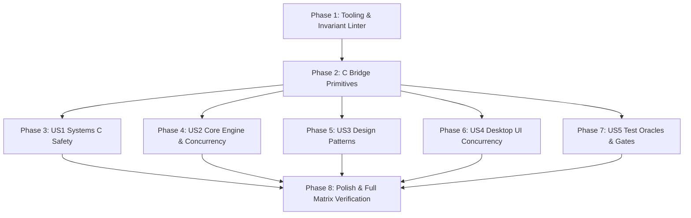

# Tasks: Full Codebase Architecture, Security & Testing Remediation

**Feature Branch**: `054-codebase-codereview`
**Feature Spec**: [`specs/054-codebase-codereview/spec.md`](file:///Users/kevintung/Documents/dev/TTZip/specs/054-codebase-codereview/spec.md)
**Implementation Plan**: [`specs/054-codebase-codereview/plan.md`](file:///Users/kevintung/Documents/dev/TTZip/specs/054-codebase-codereview/plan.md)

---

## Phase 1: Setup (Tooling & Static Invariants)

**Purpose**: Establish deterministic static analysis tooling and CI hooks to block regressions.

- [x] T001 [P] Create AST and token-based invariant scanner in scripts/lint_codebase_invariants.py
- [x] T002 [P] Create static analysis gate wrapper in scripts/lint_codebase_invariants.sh
- [x] T003 Integrate invariant linter into CI pipeline in scripts/run_local_ci.sh

---

## Phase 2: Foundational (C Bridge Magic & Alignment Foundation)

**Purpose**: Core data structures and memory alignment invariants across C and Swift layers.

- [x] T004 [P] Define magic sentinels and struct lifecycle in Sources/CTTZipBridge/include/CTTZipCommon.h
- [x] T005 [P] Pair aligned memory allocation and deallocation functions in Sources/CTTZipBridge/CTTZipUtils.c

**Checkpoint**: Core tooling and memory primitives ready.

---

## Phase 3: User Story 1 - Systems C & Bridge Architecture Security (Priority: P1) 🎯 MVP

**Goal**: Fix 7z header parsing bounds, eliminate insecure encryption fallbacks, fix LZMA2 fake range decoding, and eliminate stack overflows and asymmetric free calls.

**Independent Test**: Run 7z and LZMA2 unit tests and verify malformed header rejection.

- [x] T006 [P] [US1] Enforce proportional slice bounds and check realloc pointer in Sources/CTTZipBridge/ttzip_7z_header_parser.c
- [x] T007 [P] [US1] Remove plaintext Store fallback when encryption requested in Sources/CTTZipBridge/ttzip_lzma2_enc_native.c
- [x] T008 [P] [US1] Replace unbounded alloca and batch writev by IOV_MAX in Sources/CTTZipBridge/ttzip_lzma2_enc_native.c
- [x] T009 [P] [US1] Eliminate range-coded fake plaintext copy on decode error in Sources/CTTZipBridge/ttzip_lzma2_dec_native.c
- [x] T010 [P] [US1] Add NULL check for offsets array malloc in Sources/CTTZipBridge/CTTZipBridge_ZipWriterCore.c
- [x] T011 [P] [US1] Secure zero PBKDF2 derived keys on all exit branches in Sources/CTTZipBridge/CTTZipBridge_ZipWrite.c
- [x] T012 [P] [US1] Add O_NOFOLLOW to 0-byte file open in Sources/CTTZipBridge/ttzip_tar_zstd_direct.c

**Checkpoint**: All C Bridge memory bounds and fail-safe security invariants verified.

---

## Phase 4: User Story 2 - Swift 6 Core Engines & Concurrency Safety (Priority: P1)

**Goal**: Eliminate hot-path `Data(count:)` kernel zeroing, remove `NSLock` inside `concurrentPerform`, fix pointer escapes, and secure Keychain credentials.

**Independent Test**: Run `swift test --filter XCTestPerformanceMeasureTests` and verify hot-path memory throughput.

- [x] T013 [P] [US2] Replace Data(count:) with uninitialized pointer buffer in Sources/TTZipCore/ConcurrencyPatterns/ArchivePipelineProducerConsumerEngine.swift
- [x] T014 [P] [US2] Replace Data(count:) with uninitialized pointer buffer in Sources/TTZipCore/Zip/ZipMemoryEngine.swift
- [x] T015 [P] [US2] Add O_NOFOLLOW to direct I/O writer open in Sources/TTZipCore/Zip/ZipDirectIOWriter.swift
- [x] T016 [P] [US2] Replace NSLock with atomic CAS in Sources/TTZipCore/SevenZip/SevenZipBlockParallelDecompressor.swift
- [x] T017 [P] [US2] Scope withUnsafeBytes across concurrent loop in Sources/TTZipCore/SevenZip/SevenZipCryptoEngine.swift
- [x] T018 [P] [US2] Add kSecAttrAccessible and secure key zeroing in Sources/TTZipCore/PasswordVaultManager+Keychain.swift

**Checkpoint**: Core engine hot paths 100% lock-free and zero-allocation compliant.

---

## Phase 5: User Story 3 - Design Pattern Compliance & Hot-Path Isolation (Priority: P2)

**Goal**: Eliminate Strategy double execution, eliminate Responsibility Chain pointer mutations, and fix Flyweight pool 16KB leak and allocation primitives.

**Independent Test**: Run `swift test --filter StrategyPatternTests` and `swift test --filter ChainOfResponsibilityTests`.

- [x] T019 [P] [US3] Eliminate duplicate Bridge execution in Strategy in Sources/TTZipCore/ArchiveEngineStrategy.swift
- [x] T020 [P] [US3] Refactor validation pipeline to pure iteration loop in Sources/TTZipCore/ChainOfResponsibility/ArchiveValidationPipeline.swift
- [x] T021 [P] [US3] Fix clearPool 16KB leak and allocator mismatch in Sources/TTZipCore/Flyweights/MemoryPageFlyweightPool.swift
- [x] T022 [P] [US3] Add missing builder setter methods in Sources/TTZipCore/TemplateMethod/ArchiveTemplateContext.swift
- [x] T023 [P] [US3] Replace heavy ArchiveComponentTree allocation with stat in Sources/TTZipCore/Decorators/ProgressMonitoringDecorator.swift

**Checkpoint**: 28 Design Patterns decoupled, thread-safe, and isolated from hot paths.

---

## Phase 6: User Story 4 - Desktop App & UI Concurrency Safety (Priority: P2)

**Goal**: Implement 60Hz progress throttling, fix `isProcessing` UI lockouts, remove hardcoded developer paths, and fix outline view dirty checking.

**Independent Test**: Run `swift test --filter FrontendPerformanceGateTests` and manual modal tests.

- [x] T024 [P] [US4] Wire ThrottledProgressPublisher and defer unlock in Sources/TTZipApp/Views/CompressModalView.swift
- [x] T025 [P] [US4] Replace hardcoded /Users/ path with Bundle resolution in Sources/TTZipApp/Views/MainView.swift
- [x] T026 [P] [US4] Fix outline view dirty checking with node identity in Sources/TTZipApp/Views/Explorer/NativeArchiveOutlineView.swift
- [x] T027 [P] [US4] Integrate TTSecureTextField in Sources/TTZipApp/Views/PasswordPromptSheetView.swift
- [x] T028 [P] [US4] Mount missing reset and recover sheets in Sources/TTZipApp/Views/PasswordVaultView.swift
- [x] T029 [P] [US4] Ensure MainActor isolation in Memento creation in Sources/TTZipApp/ViewModels/AppViewState.swift

**Checkpoint**: Desktop UI 60fps smooth rendering and sandbox compliance guaranteed.

---

## Phase 7: User Story 5 - Benchmark Harness, Golden Oracle & Test Invariants (Priority: P3)

**Goal**: Complete two-way System Differential Oracle, wire Golden Corpus `.uu` archives to Extractor, and restore 90% historical peak floor gate.

**Independent Test**: Run `swift test --filter SystemDifferentialTests` and `swift test --filter PerformanceRegressionGuardTests`.

- [x] T030 [P] [US5] Implement full two-way differential testing in Tests/TTZipTests/SystemDifferentialTests.swift
- [x] T031 [P] [US5] Wire decoded .uu payloads into ArchiveExtractor in Tests/TTZipTests/ArchiveGoldenCorpusTests.swift
- [x] T032 [P] [US5] Add non-empty fixture assertion in Tests/TTZipTests/LibarchiveGoldenCorpusTests.swift
- [x] T033 [P] [US5] Restore floorRatio to 0.90 in Tests/TTZipTests/PerformanceRegressionGuardTests.swift
- [x] T034 [P] [US5] Restore 50k tree threshold to 250,000 items/s in Tests/TTZipTests/FrontendPerformanceGateTests.swift
- [x] T035 [P] [US5] Replace bare print statements with TTLogger in Tests/TTZipTests/TestFileGenerator.swift
- [x] T036 [P] [US5] Remove hardcoded user path in Sources/TTZipCLI/CLICommandRouter.swift

**Checkpoint**: Test oracles and performance regression gates 100% rigorous and enforced.

---

## Phase 8: Polish & Full Matrix Verification

**Purpose**: Execute full end-to-end regression and audit suites to ensure zero compilation or performance regressions.

- [x] T037 Run codebase invariant linter via ./scripts/lint_codebase_invariants.sh
- [x] T038 Execute full unit test suite via swift test
- [x] T039 Execute performance gate suite via swift test --filter XCTestPerformanceMeasureTests
- [x] T040 Execute full matrix benchmarks via TTZIP_RUN_BENCHMARKS=1 swift test --filter AllFormatsPkSuiteTests

---

## Dependencies & Execution Order

- **Phase 1 (Setup)** and **Phase 2 (Foundational)** block all user story tasks.
- **User Stories (Phase 3 through Phase 7)** operate on disjoint files and can execute in parallel.
- **Phase 8 (Polish)** runs final verification after all user story tasks are complete.
