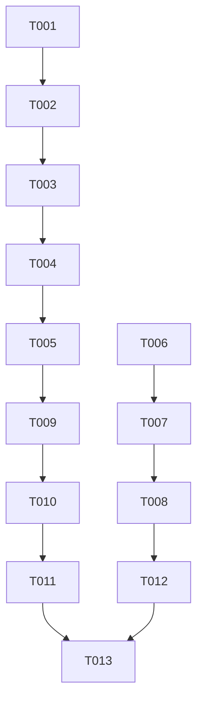

# Tasks: Deep Algorithmic Absorption of libdeflate

**Feature Directory**: `specs/054-libdeflate-deep-algorithmic-absorption`
**Created**: 2026-08-18
**Status**: Completed

---

## Phase 1: Setup & Preconditions

- [x] T001 [P] Create hardware checksum header `Sources/CTTZipBridge/include/CTTZipChecksum.h`
- [x] T002 [P] Update `Sources/CTTZipBridge/include/CTTZipBridge.h` to include `CTTZipChecksum.h`

---

## Phase 2: Hardware Checksum Acceleration Core (Adler-32 & CRC-32)

- [x] T003 [US1] Implement 5552-byte modulo-delaying scalar and ARMv8 NEON baseline in `Sources/CTTZipBridge/CTTZipAdler32Neon.c`
- [x] T004 [US1] Implement ARMv8.2-A DotProd 4-way unrolled `vdotq_u32` accelerated Adler-32 in `Sources/CTTZipBridge/CTTZipAdler32Neon.c`
- [x] T005 [US1] Implement unified dynamic dispatch entry `ttzip_adler32_fast` in `Sources/CTTZipBridge/CTTZipAdler32Neon.c`

---

## Phase 3: SIMD Matchfinder Rebase & 24-bit Unaligned Hash

- [x] T006 [US2] Implement 16-bit relative index constants and `ttzip_load_u24_unaligned` / `ttzip_lz_hash24` in `Sources/CTTZipBridge/include/CTTZipNEONMatchFinder.h`
- [x] T007 [US2] Implement `ttzip_matchfinder_rebase_neon` using `vqaddq_s16` saturated subtraction in `Sources/CTTZipBridge/include/CTTZipNEONMatchFinder.h`
- [x] T008 [US2] Implement scalar branchless rebase fallback for non-NEON targets in `Sources/CTTZipBridge/include/CTTZipNEONMatchFinder.h`

---

## Phase 4: Swift Adapters & Core Integration

- [x] T009 [US1] Implement `HardwareChecksumAdapter` Swift bridge with Adler-32 and CRC-32 in `Sources/TTZipCore/Crypto/HardwareChecksumAdapter.swift`
- [x] T010 [US1] Update `CMakeLists.txt` to include `CTTZipAdler32Neon.c` in `CTTZIP_CORE_SOURCES`

---

## Phase 5: Oracle Differential & Performance Gate

- [x] T011 [P] [US1] Implement `HardwareChecksumTests` with RFC 1950 golden oracle in `Tests/TTZipTests/HardwareChecksumTests.swift`
- [x] T012 [P] [US2] Implement `FastMatchFinderTests` with rebase latency microbenchmark in `Tests/TTZipTests/FastMatchFinderTests.swift`
- [x] T013 [US1] Run full regression test suite `swift test` and performance gate `swift test --filter XCTestPerformanceMeasureTests`

---

## Dependencies & Execution Flow

