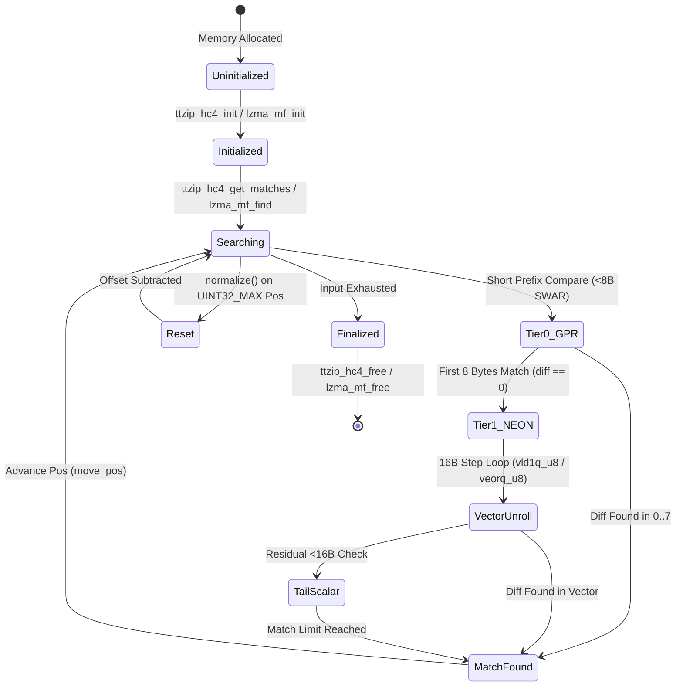

# Data Model: Liblzma (XZ Utils) ARM NEON Match Finder Acceleration & Upstream Baseline Integration

**Feature Branch**: `059-liblzma-neon-acceleration`
**Date**: 2026-08-17
**Status**: Completed

---

## 1. Core Domain Entities

### Entity 1: `MatchFinderState` (C Struct: `ttzip_hc4_t` / `lzma_mf`)
Represents the in-memory sliding dictionary window and hash-indexed search buffers for LZMA/LZMA2 match candidate discovery.

| Field Name | Type | Nullable | Constraints / Description |
| :--- | :--- | :--- | :--- |
| `buffer` | `UnsafePointer<UInt8>` | No | Pointer to uncompressed input block memory buffer |
| `buffer_size` | `UInt32` | No | Total size in bytes of the active block buffer ($1 \le \text{size} \le 2^{30}$) |
| `dict_size` | `UInt32` | No | LZMA dictionary window size ($4\text{KB} \le \text{dict\_size} \le 1\text{GB}$, power of 2) |
| `nice_len` | `UInt32` | No | Target match length threshold for early stopping ($2 \le \text{nice\_len} \le 273$) |
| `cut_value` | `UInt32` | No | Maximum hash chain traversal depth limit ($1 \le \text{cut\_value} \le 128$) |
| `len_limit` | `UInt32` | No | Upper bound on match length comparison (default: 273) |
| `pos` | `UInt32` | No | Current stream cursor position relative to buffer start ($0 \le \text{pos} \le \text{buffer\_size}$) |
| `hash_mask` | `UInt32` | No | Bitwise mask for 4-byte hash table indexing ($2^n - 1$, e.g. `0xFFFF` or `0x3FFFF`) |
| `hash2` | `UnsafeMutablePointer<UInt32>` | Yes | 2-byte direct hash table array ($65,536$ elements, 1-based indexing) |
| `hash3` | `UnsafeMutablePointer<UInt32>` | Yes | 3-byte direct hash table array ($65,536$ elements, 1-based indexing) |
| `hash4` | `UnsafeMutablePointer<UInt32>` | Yes | 4-byte CRC-indexed primary hash bucket array (`hash_mask + 1` elements) |
| `chain` | `UnsafeMutablePointer<UInt32>` | Yes | Cyclic hash collision linked chain array (`dict_size` elements) |

---

### Entity 2: `MatchCandidate` (C Struct: `ttzip_match_t` / `lzma_match`)
Represents an individual string match discovery between the current stream position and prior dictionary history.

| Field Name | Type | Nullable | Constraints / Description |
| :--- | :--- | :--- | :--- |
| `len` | `UInt32` | No | Length of matched prefix in bytes ($2 \le \text{len} \le 273$) |
| `dist` | `UInt32` | No | 0-based backward dictionary distance offset ($0 \le \text{dist} < \text{dict\_size}$) |

---

### Entity 3: `LZMAEncoderPreset`
Represents the operational compression configuration and algorithmic parameters passed into the pipeline.

| Field Name | Type | Nullable | Constraints / Description |
| :--- | :--- | :--- | :--- |
| `level` | `UInt32` | No | Compression level identifier ($0 \le \text{level} \le 9$) |
| `dict_size` | `UInt32` | No | Sliding dictionary window size in bytes |
| `match_finder` | `MatchFinderAlgorithm` | No | Enum: `HC3`, `HC4`, `BT2`, `BT3`, `BT4` |
| `nice_len` | `UInt32` | No | Optimal match length threshold ($8 \le \text{nice\_len} \le 273$) |
| `depth_limit` | `UInt32` | No | Search depth limit ($0$ for automatic heuristic) |
| `threads` | `UInt32` | No | Parallel worker thread count ($1 \le \text{threads} \le 64$) |
| `extreme_mode` | `Bool` | No | Flag indicating enhanced dynamic programming parsing |

---

### Entity 4: `MatchLengthBenchmarkRecord`
Telemetry data capturing match length comparison throughput and correctness metrics.

| Field Name | Type | Nullable | Constraints / Description |
| :--- | :--- | :--- | :--- |
| `scenario_name` | `String` | No | Identifier of test case (e.g. `short_fail`, `long_vector_unroll`) |
| `vector_width_bits` | `UInt32` | No | SIMD vector width in bits ($64$ for SWAR, $128$ for NEON) |
| `operations_per_sec` | `Double` | No | Number of string length evaluations per second ($\ge 0.0$) |
| `throughput_mb_per_sec` | `Double` | No | Effective data scanning bandwidth in MB/s ($\ge 0.0$) |
| `parity_verified` | `Bool` | No | True if output exactly matches scalar reference comparison |

---

## 2. State Lifecycle & Transitions

