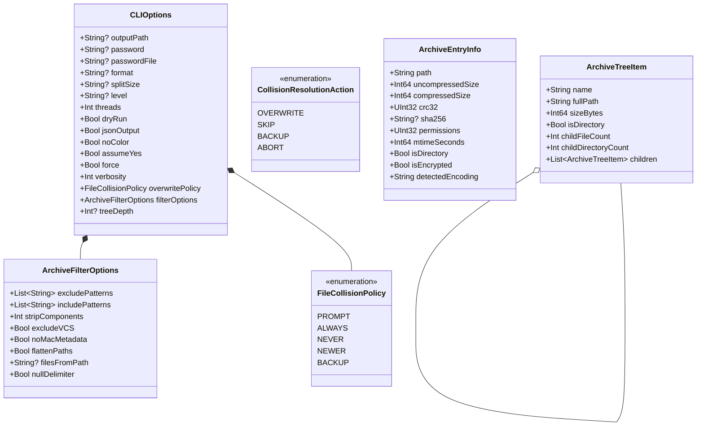

# Phase 1 Data Model: Feature 069

**Feature**: `069-cli-market-gap-parity` (Comprehensive Market Gap Parity & Terminal Ergonomics)  
**Date**: 2026-08-17  
**Status**: Ready  

---

## 1. Core Domain Entities

---

## 2. Entity Attribute Definitions & Invariants

### 2.1 `CLIOptions` (CLI Execution Configuration)

| Attribute | Type | Nullable | Description & Invariants |
| :--- | :--- | :--- | :--- |
| `positionals` | `Array<String>` | No | Ordered list of non-option command line arguments. |
| `outputPath` | `String` | Yes | Target destination directory, output archive path, or `"-"` for stdout. |
| `password` | `String` | Yes | AES-256 / ZipCrypto passphrase (emits security warning if passed on CLI). |
| `passwordFile` | `String` | Yes | Path to file containing password (opened with `O_NOFOLLOW`). |
| `format` | `String` | Yes | Target format identifier (`zip`, `7z`, `tar.zst`, `tar.gz`, `xz`, `lz4`, etc.). |
| `level` | `String` | Yes | Compression level (`0..9`, `store`, `fast`, `ultra`). |
| `splitSize` | `String` | Yes | Multi-volume chunk threshold (e.g. `100M`, `1G`). |
| `threads` | `Int` | No | Concurrency worker count (`0` = auto-detect hardware P-cores). |
| `dryRun` | `Bool` | No | If true, simulate operations without modifying disk. |
| `jsonOutput` | `Bool` | No | If true, format stdout output as structured NDJSON / JSON. |
| `noColor` | `Bool` | No | If true, strip all ANSI escape sequences. |
| `assumeYes` | `Bool` | No | Automatically confirm overwrite prompts (equivalent to `--overwrite always`). |
| `force` | `Bool` | No | Bypass TTY binary protection checks on `cat` / `extract -o -`. |
| `verbosity` | `Int` | No | Logging verbosity: `-1` (quiet), `0` (normal), `1` (verbose), `2` (debug). |
| `overwritePolicy` | `FileCollisionPolicy` | No | File collision resolution strategy (`prompt`, `always`, `never`, `newer`, `backup`). |
| `filterOptions` | `ArchiveFilterOptions` | No | Pattern matching and directory filter configuration. |
| `treeDepth` | `Int` | Yes | Maximum depth level for hierarchical `tree` rendering (`nil` = unlimited). |

---

### 2.2 `ArchiveFilterOptions` (Path Filtering & Transformation)

| Attribute | Type | Nullable | Description & Invariants |
| :--- | :--- | :--- | :--- |
| `excludePatterns` | `Array<String>` | No | POSIX glob wildcards to omit (e.g. `["*.log", "build/*"]`). |
| `includePatterns` | `Array<String>` | No | POSIX glob wildcards to include exclusively (e.g. `["*.swift"]`). |
| `stripComponents` | `Int` | No | Number of leading path elements to strip on extraction ($\ge 0$). |
| `excludeVCS` | `Bool` | No | When true, automatically filter `.git`, `.svn`, `.hg`, `.gitignore`, etc. |
| `noMacMetadata` | `Bool` | No | When true, automatically filter `.DS_Store`, `__MACOSX`, `._*` resource forks. |
| `flattenPaths` | `Bool` | No | When true (`-j`/`--flatten`), extract files flat into output folder. |
| `filesFromPath` | `String` | Yes | Path to file containing newline-delimited file path filter. |
| `nullDelimiter` | `Bool` | No | When true (`-0`/`--null`), parse manifest delimited by `\0`. |

---

### 2.3 `ArchiveEntryInfo` (Entry Metadata Model)

| Attribute | Type | Nullable | Description & Invariants |
| :--- | :--- | :--- | :--- |
| `path` | `String` | No | Archive entry relative normalized path. |
| `uncompressedSize`| `Int64` | No | Uncompressed byte count ($\ge 0$). |
| `compressedSize` | `Int64` | No | Compressed byte count stored in archive ($\ge 0$). |
| `crc32` | `UInt32` | No | 32-bit ISO 3309 CRC checksum. |
| `sha256` | `String` | Yes | Hex-encoded 64-character SHA-256 digest. |
| `permissions` | `UInt32` | No | POSIX octal file mode bits (e.g. `0o644`, `0o755`). |
| `mtimeSeconds` | `Int64` | No | POSIX modification timestamp in epoch seconds. |
| `isDirectory` | `Bool` | No | True if entry represents a directory node. |
| `isEncrypted` | `Bool` | No | True if payload requires decryption passphrase. |
| `detectedEncoding`| `String` | No | String encoding used for entry name (e.g. `UTF-8`, `GB18030`). |

---

### 2.4 `ArchiveTreeItem` (Hierarchical Visual Tree Node)

| Attribute | Type | Nullable | Description & Invariants |
| :--- | :--- | :--- | :--- |
| `name` | `String` | No | Node component name (e.g. `src` or `main.swift`). |
| `fullPath` | `String` | No | Complete path from root. |
| `sizeBytes` | `Int64` | No | Aggregate uncompressed size in bytes. |
| `isDirectory` | `Bool` | No | True if directory container. |
| `childFileCount` | `Int` | No | Total recursive file count beneath this node. |
| `childDirectoryCount`| `Int` | No | Total recursive subdirectory count beneath this node. |
| `children` | `Array<ArchiveTreeItem>` | No | Sorted list of direct child nodes. |
