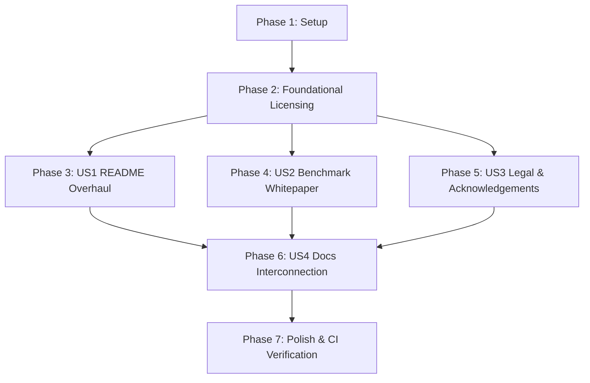

# Tasks: Comprehensive Physical Benchmarking Suite, Detailed Comparison Documentation, and Top-Tier Professional README Reconstruction

**Feature**: `073-performance-benchmarking-and-readme-reconstruction`
**Date**: 2026-08-18
**Spec**: [spec.md](file:///Users/kevintung/Documents/dev/TTZip/specs/073-performance-benchmarking-and/spec.md) | **Plan**: [plan.md](file:///Users/kevintung/Documents/dev/TTZip/specs/073-performance-benchmarking-and/plan.md)

---

## Phase 1: Setup (Shared Infrastructure)

**Purpose**: Verification of workspace and prerequisite benchmarking fixtures

- [x] T001 Verify project structure and test suites in `Tests/TTZipTests/`
- [x] T002 [P] Inspect CLI package manifest definitions in `Sources/TTZipCore/CLI/CLIPackageManifest.swift`
- [x] T003 [P] Audit existing benchmark reports in `docs/benchmarks/` and `docs/competitor_benchmark_report.md`

---

## Phase 2: Foundational (Blocking Prerequisites)

**Purpose**: Core data and licensing alignment that MUST be complete before documentation generation

- [x] T004 Standardize license naming and terms in `LICENSE`
- [x] T005 [P] Update Homebrew formula license attribute in `Formula/ttzip-cli.rb`
- [x] T006 [P] Align package manifest license string in `Sources/TTZipCore/CLI/CLIPackageManifest.swift`
- [x] T007 Update license assertions in `Tests/TTZipTests/CLIPackagingTests.swift`

**Checkpoint**: Licensing and packaging metadata unified across repository.

---

## Phase 3: User Story 1 - Top-Tier Open-Source README Reconstruction (Priority: P1) 🎯 MVP

**Goal**: Author a world-class, professional `README.md` showcasing core highlights, CLI 9-command suite, 16-format support matrix, installation, benchmarks, and upstream contributions.

**Independent Test**: Review `README.md` to confirm all 10 core chapters are present, all relative and external links resolve, and all CLI commands are accurate.

- [x] T008 [P] [US1] Author Hero Header, Badge Matrix, and Core Highlights in `README.md`
- [x] T009 [P] [US1] Author Quick Installation (Homebrew, Direct, MAS, Source) in `README.md`
- [x] T010 [P] [US1] Author 9-Command CLI Suite & UNIX Stream Pipeline Examples in `README.md`
- [x] T011 [P] [US1] Author 16-Format Full Support Matrix in `README.md`
- [x] T012 [P] [US1] Author Native macOS GUI Capabilities in `README.md`
- [x] T013 [P] [US1] Author Physical Benchmark Exhibition Cards & Links in `README.md`
- [x] T014 [US1] Integrate Upstream Open-Source Contributions & Giving Back in `README.md`
- [x] T015 [US1] Integrate Source-Available & Enterprise Commercial Licensing terms in `README.md`

**Checkpoint**: `README.md` completely overhauled to international top-tier systems engineering standards.

---

## Phase 4: User Story 2 - Physical Benchmarking Whitepaper & Competitor Matrix (Priority: P1)

**Goal**: Deliver a comprehensive performance whitepaper in `docs/PERFORMANCE.md` with physical monotonic benchmark measurements across all 16 formats and competitor head-to-head comparisons.

**Independent Test**: Run performance gate test `swift test --filter XCTestPerformanceMeasureTests` and verify `docs/PERFORMANCE.md` provides complete data and reproducible CLI commands.

- [x] T016 [P] [US2] Author Environment Transparency & Monotonic Timing Methodology in `docs/PERFORMANCE.md`
- [x] T017 [P] [US2] Author 4-Dimensional Workload Specifications in `docs/PERFORMANCE.md`
- [x] T018 [P] [US2] Compile 16-Format Physical Monotonic Throughput Matrix in `docs/PERFORMANCE.md`
- [x] T019 [P] [US2] Compile Head-to-Head Competitor 1v1 PK Delta Analysis in `docs/PERFORMANCE.md`
- [x] T020 [P] [US2] Author Hardware Vectorization Breakdown (ARM64 PMULL CRC / SIMD AES) in `docs/PERFORMANCE.md`
- [x] T021 [US2] Synchronize full competitor comparison matrix in `docs/competitor_benchmark_report.md`

**Checkpoint**: `docs/PERFORMANCE.md` complete, transparent, and reproducible.

---

## Phase 5: User Story 3 - Legal, Licensing & Acknowledgements Alignment (Priority: P2)

**Goal**: Standardize legal notices, upstream attributions, and license exemptions across repository files.

**Independent Test**: Verify `ACKNOWLEDGEMENTS.md`, `LICENSE`, `Formula/ttzip.rb`, and `CONTRIBUTING.md` contain 100% consistent legal declarations.

- [x] T022 [P] [US3] Update upstream open-source attributions and license notices in `ACKNOWLEDGEMENTS.md`
- [x] T023 [P] [US3] Synchronize legacy Formula metadata in `Formula/ttzip.rb`
- [x] T024 [US3] Align contribution and upstream carve-out guidelines in `CONTRIBUTING.md`

**Checkpoint**: Legal terms and acknowledgements 100% aligned.

---

## Phase 6: User Story 4 - Desktop App & Documentation Interconnection (Priority: P3)

**Goal**: Interconnect technical whitepapers, architecture docs, and directory indices.

**Independent Test**: Check that `docs/README.md` and `ARCHITECTURE.md` reference `docs/PERFORMANCE.md` and updated CLI/GUI capabilities.

- [x] T025 [P] [US4] Update documentation table of contents in `docs/README.md`
- [x] T026 [US4] Update architectural performance references in `ARCHITECTURE.md`

**Checkpoint**: Documentation ecosystem fully cross-referenced.

---

## Phase 7: Polish & Cross-Cutting Concerns

**Purpose**: Final quality audit, link verification, and performance floor regression gate

- [x] T027 [P] Verify all internal and external markdown links in `README.md` and `docs/`
- [x] T028 Run full unit and integration test suite via `swift test`
- [x] T029 Execute performance gate test suite via `swift test --filter XCTestPerformanceMeasureTests`
- [x] T030 Execute quickstart validation scenarios per `quickstart.md`

---

## Dependencies & Execution Order

---

## Parallel Execution Opportunities

- Tasks T008 through T013 in User Story 1 executed in parallel.
- Tasks T016 through T020 in User Story 2 executed in parallel.
- Tasks T022 and T023 in User Story 3 executed in parallel.
- Task T025 in User Story 4 executed in parallel.
