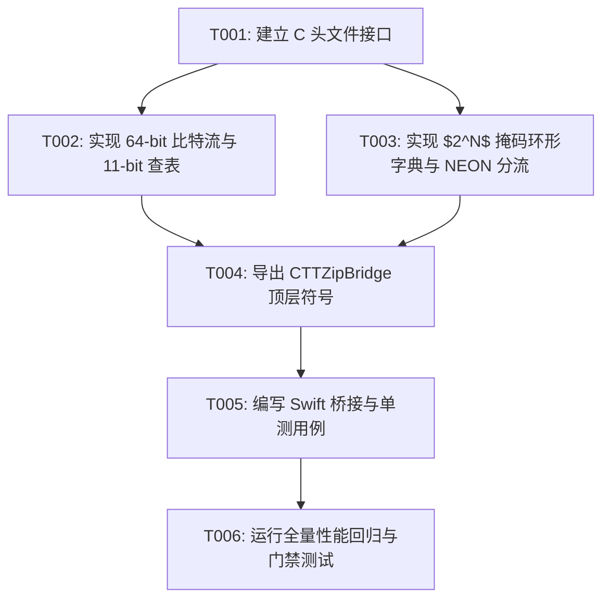

# Implementation Tasks: 084-lzham-branchless-decompression-and-circular-dict

**Feature Directory**: `specs/084-lzham-branchless-decompression-and-circular-dict`  
**Created**: 2026-08-18  
**Status**: Ready for Implementation  
**Spec Reference**: [`spec.md`](spec.md) | **Plan Reference**: [`plan.md`](plan.md)

---

## Task Overview & Dependencies

---

## Phase 1: Core Engine Header & Architecture (User Story 1 & 2)

- [x] T001 [US1] 建立分支消除解压与环形字典 C 接口定义 in `Sources/CTTZipBridge/include/ttzip_branchless_decomp.h`
- [x] T002 [P] [US2] 实现 64-bit 预取比特流与 11-bit 一级哈夫曼查表内核 in `Sources/CTTZipBridge/ttzip_branchless_decomp.c`
- [x] T003 [P] [US2] 实现 $2^N$ 掩码环形字典更新模型、NEON 向量 Fast-Path 与 Slow-Path 边界回绕 in `Sources/CTTZipBridge/ttzip_branchless_decomp.c`

---

## Phase 2: Integration & CTTZipBridge Export (User Story 2 & 3)

- [x] T004 [US2] 在 CTTZipBridge 核心头文件导出统一桥接函数与诊断符号 in `Sources/CTTZipBridge/include/CTTZipBridge.h`
- [x] T005 [US3] 编写完整的 Swift 单元测试与微基准验证套件 in `Tests/TTZipTests/BranchlessDecompTests.swift`

---

## Phase 3: Performance Regression & Verification Gate (User Story 1 & 2)

- [x] T006 [US1] 运行全量单元测试与性能门禁回归验证 in `Tests/TTZipTests/XCTestPerformanceMeasureTests.swift`
