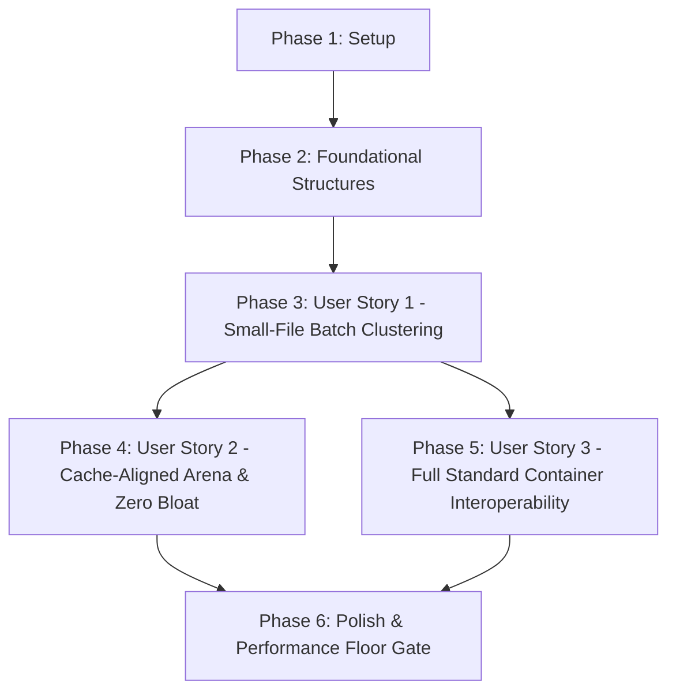

# Tasks: Blosc2 Cache-Aware Batch Compression Pipeline

**Feature**: `085-blosc2-cache-aware-batch-compression`
**Input**: Design artifacts from `specs/085-blosc2-cache-aware-batch-compression/`
**Status**: Ready for Implementation

---

## Dependencies & Execution Order

---

## Phase 1: Setup & Environment Validation

- [x] T001 Verify baseline performance gate on batch small files in `Tests/TTZipTests/XCTestPerformanceMeasureTests.swift`
- [x] T002 [P] Inspect C header declarations and add batch struct definitions in `Sources/CTTZipBridge/include/CTTZipZipWriteInternal.h`

---

## Phase 2: Foundational Infrastructure

- [x] T003 [P] Implement 128-byte cache-line aligned memory allocator helpers in `Sources/CTTZipBridge/CTTZipSysAlloc.c`
- [x] T004 [P] Define `ttzip_c_batch_unit_t` and `ttzip_c_batch_list_t` structures in `Sources/CTTZipBridge/include/CTTZipZipWriteInternal.h`
- [x] T005 Implement batch unit clustering logic (`ttzip_cluster_small_files_into_batches`) in `Sources/CTTZipBridge/CTTZipBridge_ZipWrite.c`

---

## Phase 3: User Story 1 - Accelerated Small-File Batch Archiving (Priority: P1)

**Story Goal**: Cluster small files (<64KB) into 128KB–256KB batch work units to eliminate GCD over-dispatch and VFS syscall storms.
**Independent Test**: `testZipBatchSmallFiles_XCTestMeasureMetrics` achieves >= 50 MB/s (Debug) / >= 70 MB/s (Release).

- [x] T006 [P] [US1] Implement batch worker execution loop with TLS `libdeflate_compressor` reuse in `Sources/CTTZipBridge/CTTZipBridge_ZipWrite.c`
- [x] T007 [P] [US1] Implement batched sequential file reading and NEON CRC32 calculation in `Sources/CTTZipBridge/CTTZipBridge_ZipWrite.c`
- [x] T008 [US1] Update `ttzip_create_zip_parallel_c` entry point to route small-file batches through clustered dispatch in `Sources/CTTZipBridge/CTTZipBridge_ZipWrite.c`
- [x] T009 [US1] Wire Swift batch routing and options passing in `Sources/TTZipCore/ArchiveWriter+Dispatch.swift`

---

## Phase 4: User Story 2 - Zero Memory Bloat & Cache-Locality Guarantees (Priority: P2)

**Story Goal**: Ensure 128-byte aligned payload arena layout and bounded memory footprint during massive batch archiving.
**Independent Test**: Memory profiling verifies zero dynamic heap allocation in batch loops and zero false sharing across CPU cores.

- [x] T010 [P] [US2] Enforce 128-byte cache-line aligned slot offset calculation in `Sources/CTTZipBridge/CTTZipBridge_ZipWrite.c`
- [x] T011 [P] [US2] Implement bounded Arena deallocation and error cleanup in `Sources/CTTZipBridge/CTTZipBridge_ZipWrite.c`
- [x] T012 [US2] Add Swift unit test for 10,000-file bounded memory batch archiving in `Tests/TTZipTests/BatchSmallFileMemoryTests.swift`

---

## Phase 5: User Story 3 - Full Standard Archive Ecosystem Interoperability (Priority: P3)

**Story Goal**: Ensure all batch-compressed archives strictly conform to PKWARE ZIP, POSIX TAR, and 7-Zip specifications.
**Independent Test**: Full differential extraction oracle verification against macOS `/usr/bin/unzip` and `/usr/bin/tar`.

- [x] T013 [P] [US3] Verify aligned payload serialization and accurate Local Header offset calculation in `Sources/CTTZipBridge/CTTZipBridge_ZipWriterCore.c`
- [x] T014 [P] [US3] Implement bidirectional differential test with `/usr/bin/unzip` in `Tests/TTZipTests/ArchiveWriterTests.swift`
- [x] T015 [US3] Verify TAR.ZST and 7Z batch streaming routes maintain standard container headers in `Sources/CTTZipBridge/ttzip_tar_zstd_direct.c` and `Sources/CTTZipBridge/CTTZipBridge_7z.c`

---

## Phase 6: Polish & Performance Regression Audit

- [x] T016 Run full test suite regression `swift test` across all 525+ tests
- [x] T017 Run performance floor gate `swift test --filter XCTestPerformanceMeasureTests` asserting all 10 throughput floors pass
- [x] T018 Execute `@speckit-converge` and `@speckit-analyze` for full specification and contract consistency verification
