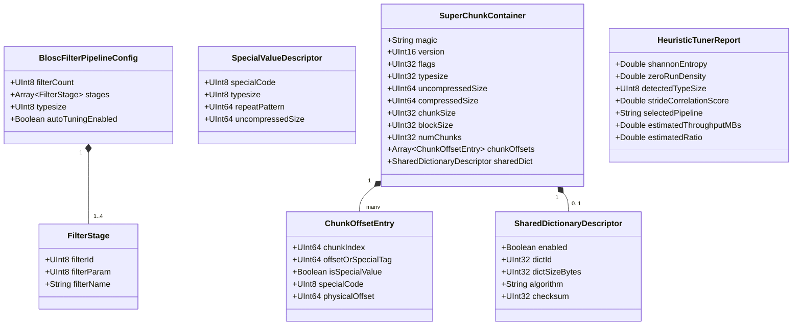

# Phase 1 Data Model: Blosc2 Architectural & Meta-Compression Entities

**Feature**: `088-blosc2-deep-architectural-study-and-integration`
**Date**: 2026-08-18
**Status**: Ready

---

## 1. Entity Overview

---

## 2. Entity Specifications & Field Constraints

### 2.1 `BloscFilterPipelineConfig`
Represents the ordered transformation chain applied prior to entropy coding.

| Field Name | Type | Constraints | Description |
| :--- | :--- | :--- | :--- |
| `filterCount` | `UInt8` | Range: `[0, 4]` | Number of active filters chained in the pipeline. |
| `stages` | `Array<FilterStage>` | Length: `filterCount` | Ordered list of filter transformations. |
| `typesize` | `UInt8` | Enum: `[1, 2, 4, 8, 16]` | Base element size in bytes for shuffle/delta operations. |
| `autoTuningEnabled` | `Boolean` | `true` or `false` | Whether heuristic micro-sampling dynamically sets stages. |

### 2.2 `FilterStage`
An individual pre-compression or post-decompression filter.

| Field Name | Type | Constraints | Description |
| :--- | :--- | :--- | :--- |
| `filterId` | `UInt8` | Enum: `0` (None), `1` (Shuffle), `2` (BitShuffle), `3` (ByteDelta), `4` (TruncPrecFloat32), `5` (TruncPrecFloat64) | Unique filter identifier. |
| `filterParam` | `UInt8` | Range: `[0, 64]` | Configuration parameter (e.g. mantissa bits to keep for TruncPrec). |
| `filterName` | `String` | Pattern: `^[a-zA-Z0-9_]+$` | Canonical human-readable filter identifier. |

### 2.3 `SpecialValueDescriptor`
Describes uniform, sparse, or constant chunks that bypass the compression codec.

| Field Name | Type | Constraints | Description |
| :--- | :--- | :--- | :--- |
| `specialCode` | `UInt8` | Enum: `0` (Standard), `1` (SpecialZero), `2` (SpecialNaN), `3` (SpecialValue), `4` (SpecialUninit) | Special value classification code. |
| `typesize` | `UInt8` | Enum: `[1, 2, 4, 8, 16]` | Element size of the repeating scalar pattern. |
| `repeatPattern` | `UInt64` | `0` to `UINT64_MAX` | The 64-bit scalar pattern to broadcast when `specialCode == 3`. |
| `uncompressedSize` | `UInt64` | Minimum: `0` | Expected uncompressed size of the block after SIMD memory fill. |

### 2.4 `SuperChunkContainer` & `ChunkOffsetEntry`
Represents the multi-chunk persistent container and sparse chunk index.

| Field Name | Type | Constraints | Description |
| :--- | :--- | :--- | :--- |
| `magic` | `String` | Fixed: `"TTZIP_SC"` or `"b2frame"` | Container file signature. |
| `version` | `UInt16` | Minimum: `1` | Format specification revision number. |
| `flags` | `UInt32` | Bitfield | Feature flags (bit 0: shared dict, bit 1: encrypted, bit 2: vlmeta). |
| `typesize` | `UInt32` | Enum: `[1, 2, 4, 8, 16]` | Base element type size. |
| `uncompressedSize`| `UInt64` | Minimum: `0` | Aggregate uncompressed byte count across all chunks. |
| `compressedSize` | `UInt64` | Minimum: `0` | Aggregate physical byte count of all compressed chunks. |
| `chunkSize` | `UInt32` | Range: `[1048576, 33554432]` (1MB–32MB) | Target macro chunk size. |
| `blockSize` | `UInt32` | Range: `[32768, 524288]` (32KB–512KB, default 131072 for Apple Silicon L1D) | Atomic micro partition block size. |
| `numChunks` | `UInt32` | Minimum: `0` | Number of chunks in the Super-Chunk. |
| `chunkOffsets` | `Array<ChunkOffsetEntry>` | Length: `numChunks` | 64-bit sparse chunk offset table. |
| `sharedDict` | `SharedDictionaryDescriptor` | Optional / Nullable | Shared dictionary metadata if enabled. |

### 2.5 `HeuristicTunerReport`
Diagnostic and telemetry output from small-sample micro-probing.

| Field Name | Type | Constraints | Description |
| :--- | :--- | :--- | :--- |
| `shannonEntropy` | `Double` | Range: `[0.0, 8.0]` | Estimated byte entropy in bits/byte. |
| `zeroRunDensity` | `Double` | Range: `[0.0, 1.0]` | Proportion of zero bytes in the micro-sample. |
| `detectedTypeSize`| `UInt8` | Enum: `[1, 2, 4, 8, 16]` | Stride exhibiting peak autocorrelation. |
| `strideCorrelationScore` | `Double` | Range: `[0.0, 1.0]` | Autocorrelation coefficient at `detectedTypeSize`. |
| `selectedPipeline` | `String` | Pattern: `^[A-Z0-9_+]+$` | Selected pipeline string (e.g. `BITSHUFFLE+BYTEDELTA+ZSTD`). |
| `estimatedThroughputMBs` | `Double` | Minimum: `0.0` | Predicted throughput for selected configuration. |
| `estimatedRatio` | `Double` | Minimum: `1.0` | Predicted compression ratio. |
