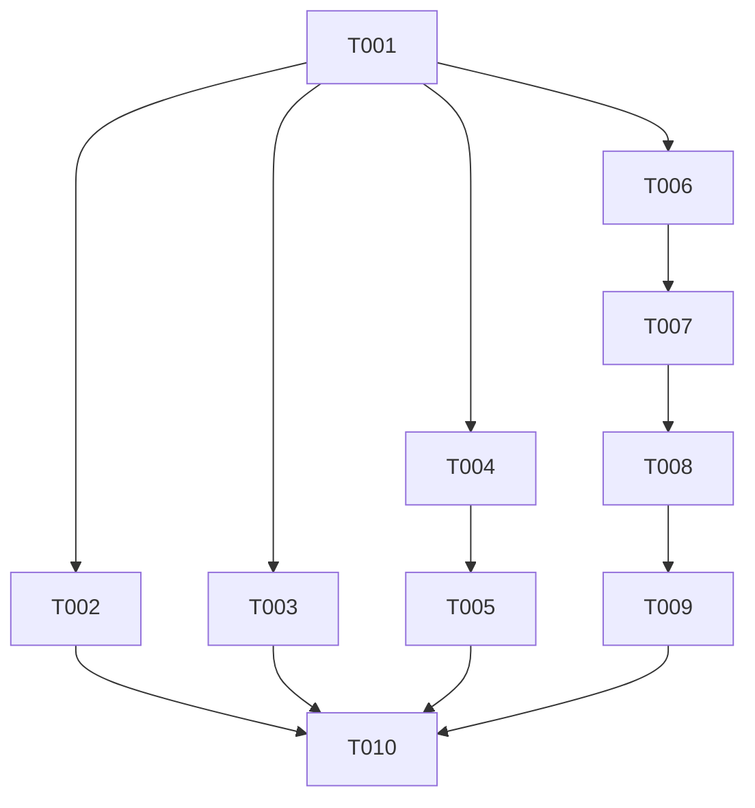

# Tasks: Codebase Algorithmic Optimization and Algebraic Kernels

**Feature Branch**: `089-codebase-algorithmic-optimization`
**Specification**: [spec.md](./spec.md)
**Plan**: [plan.md](./plan.md)

---

## Phase 1: Setup & Foundational Tasks

- [x] T001 Standardize Adler-32 mathematical documentation and verification annotations in `Sources/CTTZipBridge/CTTZipAdler32Neon.c`

---

## Phase 2: User Story 1 - Accelerated Small-Buffer and Tail Checksum Computation (Priority: P1)

**Story Goal**: Provide high-throughput, algebraically optimized checksum calculation (Adler32, CRC32, CRC64) across small buffers and remainder bytes.
**Independent Test**: `swift test --filter HardwareChecksumTests` and `swift test --filter CRC64HardwareTests` pass with 100% bit-exact equivalence.

- [x] T002 [P] [US1] Add property-based differential tests for Adler-32 unaligned slices and edge sizes in `Tests/TTZipTests/HardwareChecksumTests.swift`
- [x] T003 [P] [US1] Standardize CRC64 vector tail overlapping loads and scalar fallback bounds in `Sources/CTTZipBridge/ttzip_crc64.c`

---

## Phase 3: User Story 2 - Zero-Overhead Archive Header and Number Parsing (Priority: P1)

**Story Goal**: Eliminate libc `sscanf` overhead, branch mispredictions, and Undefined Behavior in TAR octal parsing, 512-byte header checksum validation, and 7Z variable-length integer decoding.
**Independent Test**: `swift test --filter SevenZipHeaderParserTests` and `swift test --filter TarNativeArchiveTests` pass with zero failures.

- [x] T004 [P] [US2] Implement branchless 7Z variable-length integer decoder `ttzip_7z_read_varint_fast` with `__builtin_clz`, 64-bit load, and UB shift clamping in `Sources/CTTZipBridge/ttzip_7z_header_parser.c`
- [x] T005 [P] [US2] Add unit tests for 64-bit 9-byte varints and boundary conditions in `Tests/TTZipTests/SevenZipHeaderParserTests.swift`
- [x] T006 [P] [US2] Implement 3-level SWAR octal-to-integer conversion (`ttzip_octal_parse8_swar`) and 512-byte zero block check in `Sources/CTTZipBridge/ttzip_tar_native.c` and `Sources/CTTZipBridge/include/ttzip_tar_native.h`
- [x] T007 [P] [US2] Implement ARM64 NEON `vpadalq` and 64-bit SWAR dual signed/unsigned 512-byte header checksum calculation in `Sources/CTTZipBridge/ttzip_tar_native.c`
- [x] T008 [US2] Update native TAR header parsing fast-paths in `Sources/CTTZipBridge/ttzip_native_archive.c` to use `ttzip_octal_parse8_swar` and checksum verification

---

## Phase 4: User Story 3 & 4 - Core Verification & Zero-Regression Hardening (Priority: P2 & P3)

**Story Goal**: Prove mathematical correctness, absence of regressions, and compliance with all constitution throughput floors.
**Independent Test**: `swift test` (525+ tests pass) and `swift test --filter XCTestPerformanceMeasureTests` (all 13 performance gates pass).

- [x] T009 [P] [US3] Add TAR SWAR parsing and checksum verification unit tests in `Tests/TTZipTests/TarNativeEngineTests.swift`
- [x] T010 [US4] Execute full test suite regression and performance gate measurements across all formats

---

## Dependency Graph & Implementation Strategy

- **MVP Scope**: User Story 1 (T001–T003) & User Story 2 (T004–T008) deliver immediate performance and correctness gains for checksums, 7Z varints, and TAR headers.
- **Parallel Opportunities**:
  - `[P]` T002, T003, T004, T006 can execute in parallel.
  - `[P]` T005 and T009 can be developed and validated in parallel.
