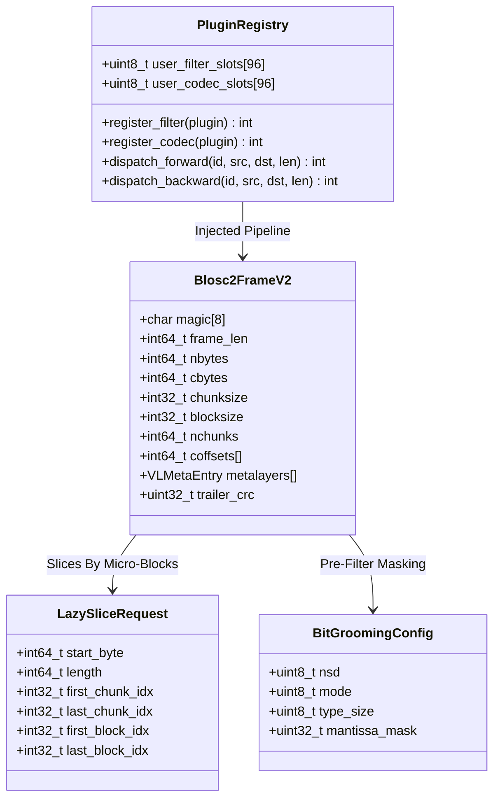

# Phase 1 Data Model: Blosc2 Exhaustive Architectural Conquest

**Feature**: `specs/091-blosc2-exhaustive-architectural-conquest`  
**Date**: 2026-08-18  

---

## 1. Entities & Structural Definitions

---

## 2. Invariants & Data Constraints

1. **Plugin ID Range Invariant**:
   - Built-in filter/codec IDs: $0 \le ID \le 159$.
   - User-defined plugin IDs: $160 \le ID \le 255$.
   - Attempting to register outside $[160, 255]$ returns an error code `-1`.
2. **Lazy Slicing Range Invariant**:
   - Slicing bounds: $0 \le \text{start\_byte} < \text{uncompressed\_size}$.
   - $\text{start\_byte} + \text{length} \le \text{uncompressed\_size}$.
   - For all skipped blocks $b < \text{first\_block}$ and $b > \text{last\_block}$, zero decompression calls and zero byte buffer allocations are performed.
3. **Bit-Grooming Precision Invariant**:
   - For `float32`, $1 \le \text{NSD} \le 7$. Mantissa bits kept: $\text{prc} = \lceil 3.321928 \times \text{NSD} \rceil + 1$.
   - For `float64`, $1 \le \text{NSD} \le 15$. Mantissa bits kept: $\text{prc} = \lceil 3.321928 \times \text{NSD} \rceil + 2$.
   - Guaranteed bounded relative precision: $\frac{|x - x_{\text{quant}}|}{|x|} \le 0.5 \times 10^{1 - \text{NSD}}$.
4. **Frame Format Invariant**:
   - Frame header starts with 8-byte magic `0x62326672616D6500` (`"b2frame\0"`).
   - Trailer starts with 8-byte magic `"TTZIPVLM"` and ends with 4-byte CRC-32 integrity tag.
