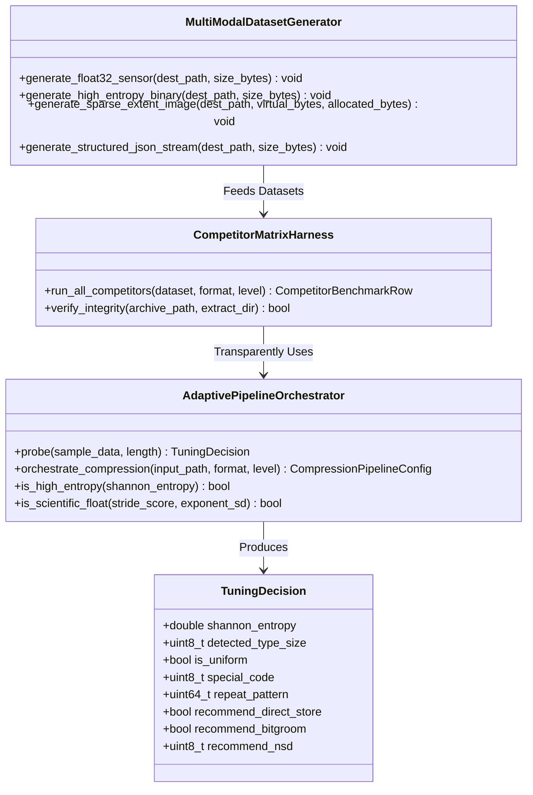

# Phase 1 Data Model: Comprehensive Optimization Default Assembly

**Feature**: `specs/092-comprehensive-optimization-default-assembly`  
**Date**: 2026-08-18  

---

## 1. Entities & Structural Definitions

---

## 2. Invariants & Data Constraints

1. **Zero-Configuration Invariant (Default Transparent Behavior)**:
   - For all regular files $\ge 16\text{KB}$, the adaptive probe MUST execute within $5.0\,\mu\text{s}$ per file without requiring any explicit user flags.
   - When Shannon entropy $H > 7.65$, compression method MUST automatically degrade to Store/Direct (Method 0 / raw uncompressed copy).
2. **Float32 Detection Invariant**:
   - Stride autocorrelation $R(4) \ge 0.70$ AND normalized float ratio $\ge 0.95$ AND exponent standard deviation $\sigma_E \le 16.0$ MUST be satisfied before injecting Bit-Grooming.
   - Bounded relative error for $\text{NSD}=3$ MUST be $\le 0.5\%$.
3. **Zero Heap Allocation on Stream Ingestion**:
   - Dataset generation and micro-sampling MUST use page-aligned POSIX buffers (`PlatformMemory.allocateAlignedPageBuffer(byteCount: 65536)`) and direct file descriptors. No `Data(count:)` multi-megabyte heap allocation.
