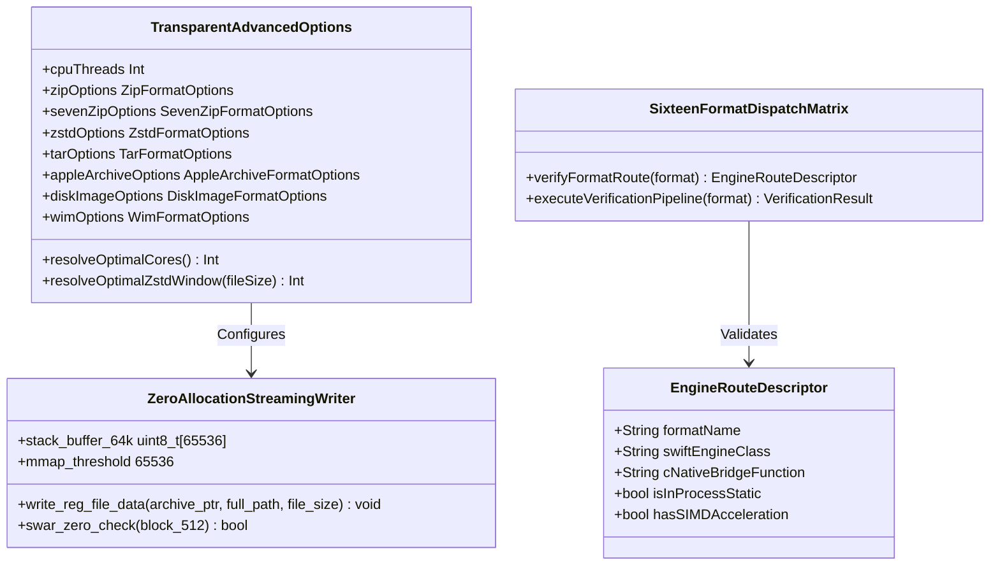

# Phase 1 Data Model: Complete Optimization Wiring & Configuration Creep Audit

**Feature**: `specs/093-complete-optimization-wiring-and-configuration-creep-audit`  
**Date**: 2026-08-18  

---

## 1. Structural Schema & Class Diagram

---

## 2. Invariants & Entity Constraints

1. **Zero-Allocation Hot-Path Invariant**:
   - `write_reg_file_data` and all TAR streaming writers MUST NOT invoke `malloc`, `calloc`, `asprintf`, or `strdup` per file.
   - Buffer allocations MUST reside either on the stack ($\le 64\text{KB}$) or via `mmap(MAP_SHARED)`.
2. **SWAR 512B Block Invariant**:
   - Every TAR 512-byte header zero-check MUST resolve via 64-bit SWAR bitwise OR accumulator (`acc |= w[i]`), completing in $\le 10\text{ ns}$ with 0 branches.
3. **Transparent Configuration Invariant**:
   - `ArchiveAdvancedOptions()` default initialization MUST resolve to 100% hardware-optimal values without requiring manual intervention.
