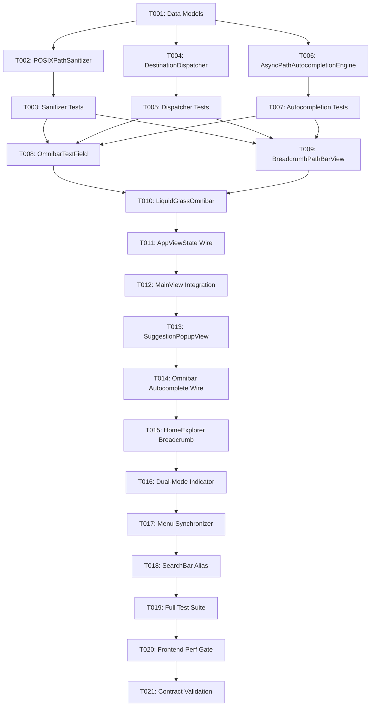

# Tasks: Unified Path and Search Address Bar (一体化路径与搜索地址栏)

**Feature Branch**: `098-unified-path-search-bar`
**Created**: 2026-08-18
**Status**: Ready for Implementation

---

## Phase 1: Setup & Data Models

**Purpose**: Define core models and types shared across omnibar services and views

- [x] T001 Create data models (AddressBarInputMode, PathResolutionType, PathResolutionResult, PathSuggestionItem, BreadcrumbSegment) in Sources/TTZipApp/Models/AddressBarModels.swift

---

## Phase 2: Foundational (Blocking Prerequisites)

**Purpose**: Core path resolution, autocompletion engine, and destination routing services

**⚠️ CRITICAL**: Foundational services MUST be implemented and tested before user story view integrations

- [x] T002 [P] Implement POSIXPathSanitizer in Sources/TTZipApp/Services/POSIXPathSanitizer.swift
- [x] T003 [P] Write unit test suite POSIXPathSanitizerTests in Tests/TTZipTests/POSIXPathSanitizerTests.swift
- [x] T004 Implement DestinationDispatcher in Sources/TTZipApp/Services/DestinationDispatcher.swift
- [x] T005 [P] Write unit test suite DestinationDispatcherTests in Tests/TTZipTests/DestinationDispatcherTests.swift
- [x] T006 [P] Implement AsyncPathAutocompletionEngine with LRU cache in Sources/TTZipApp/Services/AsyncPathAutocompletionEngine.swift
- [x] T007 [P] Write unit test suite AsyncPathAutocompletionTests in Tests/TTZipTests/AsyncPathAutocompletionTests.swift

**Checkpoint**: Foundation ready - path sanitization, classification, autocompletion, and test suites fully passing.

---

## Phase 3: User Story 1 - Direct Path Input & Instant Navigation (Priority: P1) 🎯 MVP

**Goal**: Users can type or paste any directory/archive path, press Enter, and navigate directly with full keyboard shortcut support (`⌘L`, `⇧⌘G`).

**Independent Test**: Focus address bar, enter `~/Downloads`, press Enter, and verify `AppViewState.currentDirectory` updates to user's Downloads directory.

- [x] T008 [P] [US1] Implement AppKit OmnibarTextField with IME hasMarkedText immunity and full-selection coordinator in Sources/TTZipApp/Views/Components/OmnibarTextField.swift
- [x] T009 [P] [US1] Implement BreadcrumbPathBarView for idle clickable path capsule display in Sources/TTZipApp/Views/Components/BreadcrumbPathBarView.swift
- [x] T010 [US1] Implement unified LiquidGlassOmnibar component with idle/edit mode transitions in Sources/TTZipApp/Views/Components/LiquidGlassOmnibar.swift
- [x] T011 [US1] Update AppViewState navigation state to wire omnibar navigation actions in Sources/TTZipApp/ViewModels/AppViewState.swift
- [x] T012 [US1] Embed LiquidGlassOmnibar in top navigation bar of Sources/TTZipApp/Views/MainView.swift

**Checkpoint**: User Story 1 complete — Direct path entry, breadcrumb display, and `⌘L`/`⇧⌘G` navigation functional.

---

## Phase 4: User Story 2 - Real-Time Path Autocomplete & Dropdown (Priority: P2)

**Goal**: Users typing partial paths see an instant autocompletion dropdown with folder candidates, selectable via `↑`/`↓` and autocompleted with `Tab`.

**Independent Test**: Type `/usr/` and verify dropdown lists `/usr/bin`, `/usr/lib`, etc., navigable by keyboard.

- [x] T013 [US2] Implement OmnibarSuggestionPopupView with Liquid Glass styling and arrow selection in Sources/TTZipApp/Views/Components/OmnibarSuggestionPopupView.swift
- [x] T014 [US2] Connect LiquidGlassOmnibar to AsyncPathAutocompletionEngine and wire Tab/Arrow/Return key events in Sources/TTZipApp/Views/Components/LiquidGlassOmnibar.swift
- [x] T015 [US2] Integrate dynamic path breadcrumbs into Sources/TTZipApp/Views/Explorer/HomeExplorerContainerView.swift

**Checkpoint**: User Story 2 complete — Autocomplete suggestions pop up asynchronously with sub-15ms latency.

---

## Phase 5: User Story 3 - Unified Search vs Path Dual-Mode Switching (Priority: P3)

**Goal**: Omnibar seamlessly switches between Path Navigation mode (Gold accent, directory completion) and Spotlight Search mode (Green accent, file/archive query).

**Independent Test**: Enter "archive" to see Spotlight search results; enter "/tmp" to see directory suggestions.

- [x] T016 [US3] Add dual-mode visual indicator (Kintsugi Gold for Path, Bamboo Green for Spotlight) in Sources/TTZipApp/Views/Components/LiquidGlassOmnibar.swift
- [x] T017 [US3] Register global menu bar shortcuts (Cmd+L, Shift+Cmd+G) in Sources/TTZipApp/Services/AppKitMenuSynchronizer.swift
- [x] T018 [US3] Update LiquidGlassSearchBar.swift to redirect to LiquidGlassOmnibar for backwards compatibility in Sources/TTZipApp/Views/Components/LiquidGlassSearchBar.swift

**Checkpoint**: User Story 3 complete — Dual mode transitions smoothly with full menu bar synchronization.

---

## Phase 6: Polish & Quality Verification

**Purpose**: Ensure zero performance regression, full test passing, and contract compliance.

- [x] T019 [P] Run full test suite for path resolution, autocompletion, and dispatcher
- [x] T020 [P] Run frontend performance gate tests in Tests/TTZipTests/FrontendPerformanceGateTests.swift
- [x] T021 Verify schema compliance with contracts/address-bar-api-schema.json and contracts/path-autocompletion-schema.json

---

## Dependencies & Execution Order

---

## Parallel Execution Opportunities

- **Phase 2 Parallel Execution**:
  - `T002` + `T003` (Sanitizer) and `T004` + `T005` (Dispatcher) and `T006` + `T007` (Autocompleter) can be developed and tested concurrently across independent files.
- **Phase 3 Parallel Execution**:
  - `T008` (`OmnibarTextField.swift`) and `T009` (`BreadcrumbPathBarView.swift`) can be developed concurrently.
- **Phase 6 Parallel Execution**:
  - `T019` (Unit tests) and `T020` (Frontend performance gate) can execute in parallel.
