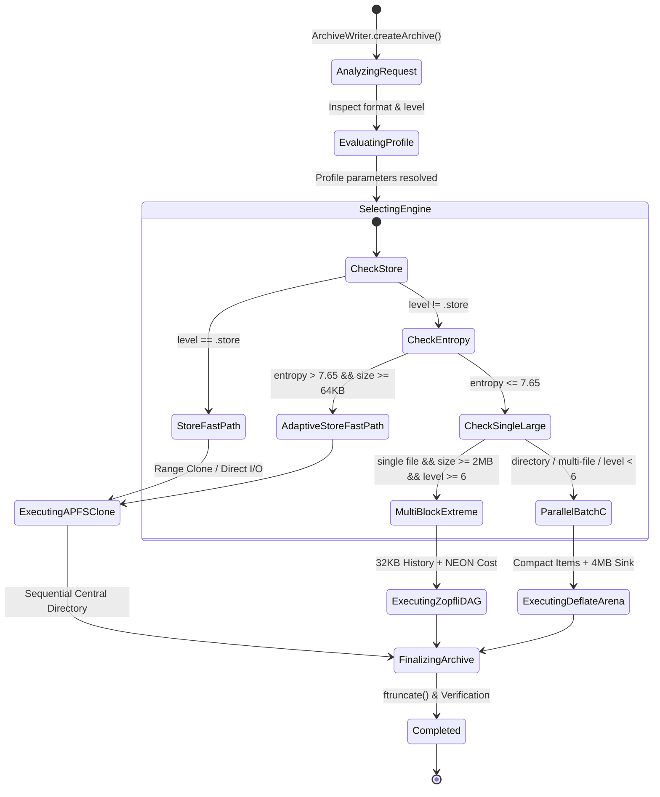

# Data Model: ZIP Compression Architecture & Micro-Optimization Survey (112-zip-architecture-and-micro-optimization)

## Entity Definitions

### 1. `ZipCompressionPlan`
Defines the resolved execution plan for an incoming ZIP archiving task.

| Field Name | Type | Nullable | Description | Validation / Constraints |
| :--- | :--- | :--- | :--- | :--- |
| `taskID` | `String` | No | Unique UUID for the compression task | UUIDv4 format |
| `mode` | `ZipExecutionMode` | No | Selected routing execution branch | Enum: `storeDirectIO`, `adaptiveStore`, `multiBlockExtreme`, `parallelBatchC`, `swiftParallelFallback` |
| `tierLevel` | `Int` | No | Tier level 0 through 7 | $0 \le \text{tierLevel} \le 7$ |
| `deflateLevel` | `Int` | No | Underlying raw Deflate level | $0 \le \text{deflateLevel} \le 12$ |
| `targetChunkSizeBytes` | `Int64` | No | Target chunk size for multi-block slicing | $65536 \le \text{size} \le 16777216$ |
| `enableHistoryWarmup` | `Bool` | No | Whether 32KB cross-block history is enabled | Boolean |
| `enableNeonVectorization` | `Bool` | No | Whether ARM64 NEON SIMD routines are activated | Boolean |
| `totalInputFiles` | `Int` | No | Total count of files in the batch | $\ge 0$ |
| `totalInputBytes` | `Int64` | No | Total uncompressed input bytes | $\ge 0$ |

---

### 2. `ZipCompactItem` (C struct `ttzip_compact_item_t`)
Compact 48-byte metadata descriptor replacing 8,248-byte `ttzip_c_item_t`.

| Field Name | Type | Nullable | Description | Validation / Constraints |
| :--- | :--- | :--- | :--- | :--- |
| `srcPathOffset` | `UInt32` | No | Byte offset into continuous string arena for source path | $\ge 0$ |
| `srcPathLength` | `UInt16` | No | Length of source path in bytes | $0 < \text{len} \le 4096$ |
| `relPathOffset` | `UInt32` | No | Byte offset into continuous string arena for relative path | $\ge 0$ |
| `relPathLength` | `UInt16` | No | Length of relative path in bytes | $0 < \text{len} \le 4096$ |
| `uncompressedSize` | `Int64` | No | Uncompressed file size in bytes | $\ge 0$ |
| `compressedSize` | `Int64` | No | Compressed payload size in bytes | $\ge 0$ |
| `crc32` | `UInt32` | No | CRC-32 checksum of file content | 32-bit unsigned integer |
| `mtime` | `Int64` | No | POSIX modification timestamp | $\ge 0$ |
| `mode` | `UInt16` | No | POSIX file mode (permissions & file type) | Standard POSIX mode bits |
| `isSymlink` | `Bool` | No | Whether entry is a symbolic link | Boolean |

---

### 3. `ZipMicroOptimizationTelemetry`
Telemetry metrics captured during execution for regression analysis.

| Field Name | Type | Nullable | Description | Validation / Constraints |
| :--- | :--- | :--- | :--- | :--- |
| `taskID` | `String` | No | Reference to associated compression task | UUIDv4 |
| `heapAllocationsCount` | `Int` | No | Number of dynamic heap allocations on hot path | Target: 0 in steady state |
| `pwriteSyscallsCount` | `Int` | No | Total `pwrite` / `write` syscalls executed | Monitored |
| `totalDurationMs` | `Double` | No | Total end-to-end execution time in milliseconds | $> 0.0$ |
| `throughputMBs` | `Double` | No | Physical compression throughput in MB/s | $> 0.0$ |
| `spaceSavingsPct` | `Double` | No | Percentage of uncompressed space saved | $-10.0 \le \text{pct} \le 100.0$ |
| `cacheHitRateEpoch` | `Double` | No | Epoch-based hash table reuse rate | $0.0 \le \text{rate} \le 1.0$ |
| `neonMatchCalls` | `Int64` | No | Number of 128-bit NEON match length operations | $\ge 0$ |

---

## State Transition & Execution Flow

