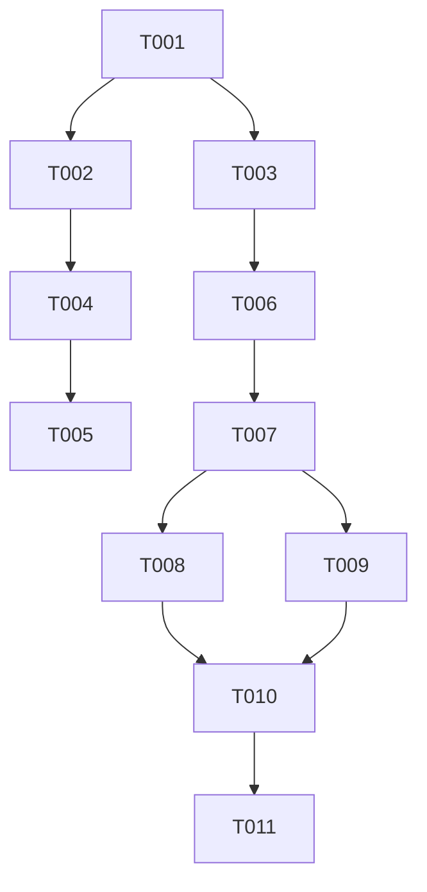

# Tasks: ZIP 8-Tier Rebalancing & Intermediate Pareto Frontier Bridge

**Feature**: [`specs/114-zip-tier-rebalance-and-intermediate-pareto/spec.md`](file:///Users/kevintung/Documents/dev/TTZip/specs/114-zip-tier-rebalance-and-intermediate-pareto/spec.md)  
**Status**: Ready for Implementation  

---

## Dependencies & Execution Strategy

- **User Story 1 (P1)**: Eliminates redundant Tier 2 and establishes the new 8-tier indexing (Tiers 0..7).
- **User Story 2 (P1)**: Implements and wires new Tier 4 (`libdeflate Level 12`) to bridge the 210x throughput gap.
- **User Story 3 (P2)**: Aligns single-core and multi-core Pareto benchmarks with streaming `TestTerminalRenderer` output.

---

## Phase 1: Setup & Data Model Alignment

- [x] T001 [P] Update `ZipCompressionProfile` presets and add backward-compatibility aliases in `Sources/TTZipCore/Zip/ZipCompressionProfile.swift`

---

## Phase 2: Foundational C Engine & Dispatch Routing

- [x] T002 [P] Update C engine options initialization and Level 12 fast-path in `Sources/CTTZipBridge/ttzip_zopfli_engine.c`
- [x] T003 [P] Update single large file extreme block compression router in `Sources/TTZipCore/ArchiveWriter+Dispatch.swift`

---

## Phase 3: User Story 1 - Elimination of Redundant Tier 2 & Profile Re-indexing (P1)

- [x] T004 [P] [US1] Update UI preset display names and throughput labels in `Sources/TTZipApp/Views/Components/CompressIntegratedConfigSectionView.swift`
- [x] T005 [P] [US1] Update deprecated `fastPlus` references in `Tests/TTZipTests/NativeDeflateEngineTests.swift`

---

## Phase 4: User Story 2 - Intermediate Pareto Bridge Tier (P1)

- [x] T006 [P] [US2] Wire Tier 4 Level 12 multi-core block compression in `Sources/TTZipCore/Zip/ZipExtremeBlockWriter.swift`
- [x] T007 [US2] Validate Tier 4 payload compression and speed on 100MB corpus in `Tests/TTZipTests/ZipMultiCoreParetoFrontierPkTests.swift`

---

## Phase 5: User Story 3 - Single-Core & Multi-Core Benchmark Alignment (P2)

- [x] T008 [P] [US3] Update single-core 8-tier benchmark loop in `Tests/TTZipTests/ZipSingleCoreParetoFrontierPkTests.swift`
- [x] T009 [P] [US3] Update multi-core 8-tier benchmark loop in `Tests/TTZipTests/ZipMultiCoreParetoFrontierPkTests.swift`

---

## Phase 6: Polish & Verification

- [x] T010 Execute performance measure tests and assert zero regression across all gates via `swift test --filter XCTestPerformanceMeasureTests`
- [x] T011 Regenerate and export high-resolution Pareto frontier charts `pareto_pk_zip_singlecore.png` and `pareto_pk_zip_multicore.png`
