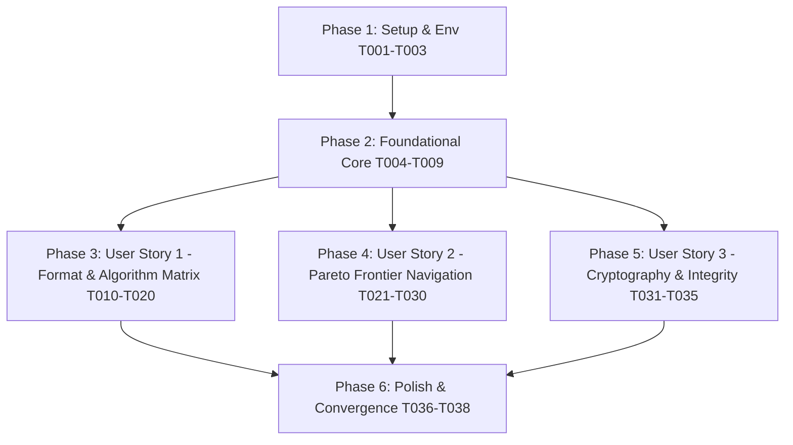

# Tasks: Full Compression Formats and Algorithms Analysis

**Input**: Design documents from `/specs/138-compression-formats-algorithms/` (`spec.md`, `plan.md`, `research.md`, `data-model.md`, `contracts/`, `quickstart.md`).  
**Prerequisites**: `plan.md` (passed), `spec.md` (passed), `research.md` (passed), `data-model.md` (passed), `contracts/` (passed).  
**Organization**: Tasks are grouped by user story (US1: Architecture Taxonomy, US2: Pareto Navigation, US3: Integrity & Cryptography) with explicit `[P]` parallelism markers and precise file paths.

---

## Phase 1: Setup & Environment Validation

**Purpose**: Verify repository build integrity, hardware CPU capabilities, and baseline contracts.

- [ ] T001 Verify Swift 6 toolchain, C11 compiler flags, and Apple Silicon SIMD feature gates in `Package.swift`
- [ ] T002 [P] Validate schema integrity of JSON contracts in `specs/138-compression-formats-algorithms/contracts/format-matrix-schema.json`
- [ ] T003 [P] Validate algorithm specification schema in `specs/138-compression-formats-algorithms/contracts/algorithm-spec-schema.json`

---

## Phase 2: Foundational Architecture & Engine Core

**Purpose**: Core infrastructure and hardware dispatch tables that MUST be verified before user story validation.

- [ ] T004 Validate hardware CPU feature detection and P/E-core topology detection in `Sources/TTZipCore/AppleSiliconTuner.swift`
- [ ] T005 [P] Audit zero-copy memory-mapped I/O handle and page prefetching advice in `Sources/CTTZipBridge/CTTZipBridge_Mmap.c`
- [ ] T006 [P] Verify ARM64 PMULL CRC64 Galois Field vector folding micro-kernel in `Sources/CTTZipBridge/ttzip_crc64.c`
- [ ] T007 [P] Verify ARMv8 ACLE CRC32 and PMULL 12-way folding in `Sources/CTTZipBridge/CTTZipCRC32Neon.c`
- [ ] T008 [P] Verify ARM NEON DotProduct Adler-32 with $N_{\max} = 5552$ deferred modulo in `Sources/CTTZipBridge/CTTZipAdler32Neon.c`
- [ ] T009 Verify memory zeroization and Dead-Store Elimination immunity via `ttzip_secure_zero` in `Sources/CTTZipBridge/include/CTTZipCommon.h`

---

## Phase 3: User Story 1 - Full-Matrix Format & Algorithm Architecture Exploration (Priority: P1) 🎯 MVP

**Goal**: Document and verify the complete structural layout of all 16 primary archive formats and 14 underlying compression algorithms.

### Implementation Tasks for User Story 1

- [ ] T010 [P] [US1] Map all 16 primary container formats (ZIP, 7Z, TAR, TAR.GZ, TAR.ZST, TAR.BZ2, TAR.XZ, LZIP, LZ4, BROTLI, LRZIP, AAR, SNAPPY, WIM, DMG, ISO) in `Sources/TTZipCore/ArchiveCompressionTypes.swift`
- [ ] T011 [P] [US1] Document ZIP Central Directory, EOCD, and Zip64 extraction layout in `Sources/CTTZipBridge/CTTZipParser.c`
- [ ] T012 [P] [US1] Document 7Z Start Header, Varint reader, and Coders DAG graph in `Sources/CTTZipBridge/ttzip_7z_header_parser.c`
- [ ] T013 [P] [US1] Document TAR UStar/PAX 512-byte block framing and direct Zstandard streaming in `Sources/CTTZipBridge/ttzip_tar_zstd_direct.c`
- [ ] T014 [P] [US1] Document Microsoft WIM 32KB chunk tables and SHA-1 resource lookup in `Sources/CTTZipBridge/CTTZipBridge_Archive.c`
- [ ] T015 [P] [US1] Document Apple UDIF DMG `koly` trailer and `mish` block descriptor demuxing in `Sources/CTTZipBridge/ttzip_dmg_demux.c`
- [ ] T016 [P] [US1] Document ISO 9660 PVD/SVD, Joliet UCS-2BE, and Rock Ridge POSIX records in `Sources/CTTZipBridge/CTTZipParser.c`
- [ ] T017 [P] [US1] Document Apple Archive (`.aar`) FieldKey attribute streams and LZFSE chunking in `Sources/TTZipCore/NativeAppleArchiveEngine.swift`
- [ ] T018 [US1] Implement dual-tier Deflate RFC 1951 SWAR/NEON match finders and Canonical Huffman in `Sources/CTTZipBridge/native_deflate/ttzip_deflate_engine.c`
- [ ] T019 [US1] Implement Fast-LZMA2 Range Coder, Markov state transitions, and BCJ filters in `Sources/CTTZipBridge/fast-lzma2/lzma2_enc.c`
- [ ] T020 [P] [US1] Verify format registry and compression level mappings via unit tests in `Tests/TTZipTests/ArchiveCompressionTypesTests.swift`

---

## Phase 4: User Story 2 - Algorithmic Trade-off & Pareto Frontier Navigation (Priority: P2)

**Goal**: Establish throughput, compression ratio, memory bounds, and Pareto trade-off curves across all 4 industrial workload types.

### Implementation Tasks for User Story 2

- [ ] T021 [P] [US2] Document Zstandard (RFC 8878) division-free tANS / FSE state transitions and 4-stream Huffman in `Sources/CTTZipBridge/CTTZipBridge_Zstd.c`
- [ ] T022 [P] [US2] Document LZ4 / LZ4-HC 1-byte token stream and SIMD wildcopy memory engine in `Vendor/lz4-upstream/lib/lz4.c`
- [ ] T023 [P] [US2] Document Apple LZFSE 4-state interleaved FSE and 2.03MB L2 cache scratch arena in `Sources/CTTZipBridge/CTTZipBridge_LZFSE.c`
- [ ] T024 [P] [US2] Document Snappy byte-aligned tag headers and ARMv8 CRC32C acceleration in `Sources/CTTZipBridge/CTTZipBridge_Snappy.c`
- [ ] T025 [P] [US2] Document Brotli (RFC 7932) 2nd-order context modeling and 120KB static dictionary in `Sources/TTZipCore/Adapters/BrotliCAdapter.swift`
- [ ] T026 [P] [US2] Document BZIP2 BWT suffix sorting, Move-To-Front, and RLE2 zero-run coding in `Sources/TTZipCore/Adapters/Bzip2CAdapter.swift`
- [ ] T027 [P] [US2] Document PPMd Model H/I order-$k$ context tree, SEE tables, and Range Coder in `Sources/TTZipCore/SevenZip/SevenZipModels.swift`
- [ ] T028 [P] [US2] Document LRZIP rzip 1st-stage RAM sliding block hash tree search in `Sources/TTZipCore/Adapters/LrzipCAdapter.swift`
- [ ] T029 [P] [US2] Document Bit-Grooming mantissa zeroing and Byte-Shuffle transposition in `Sources/CTTZipBridge/CTTZipBitGroom.c` and `Sources/CTTZipBridge/CTTZipFilterPipeline.c`
- [ ] T030 [US2] Generate multi-workload Pareto comparison matrix across all 16 formats in `docs/PERFORMANCE.md`

---

## Phase 5: User Story 3 - Cryptographic & Data Integrity Invariant Analysis (Priority: P3)

**Goal**: Audit and verify cryptographic hardening, key derivation functions, and hardware integrity verification pipelines.

### Implementation Tasks for User Story 3

- [ ] T031 [P] [US3] Verify 7Z AES-256-CBC 512KB parallel chunk decryption and SHA-256 KDF in `Sources/CTTZipBridge/ttzip_7z_crypto_neon.c`
- [ ] T032 [P] [US3] Verify WinZip AES-256 CTR (AE-1/AE-2), PBKDF2-HMAC-SHA1, and TLS key cache in `Sources/CTTZipBridge/CTTZipBridge_Crypto.c`
- [ ] T033 [P] [US3] Verify DMG Apple Encrypted partition demuxing and key unwrapping in `Sources/CTTZipBridge/ttzip_dmg_demux.c`
- [ ] T034 [P] [US3] Verify xxHash64, BLAKE2sp, and hardware SHA-256 stream hashing in `Sources/TTZipCore/HashCalculator.swift`
- [ ] T035 [US3] Validate cryptographic test vectors and memory zeroization via `Tests/TTZipTests/ArchiveSecurityTests.swift`

---

## Phase 6: Polish & Cross-Cutting Documentation Convergence

**Purpose**: Consolidate whitepapers, format specifications, and architectural documentation.

- [ ] T036 [P] Update software architecture documentation in `ARCHITECTURE.md`
- [ ] T037 [P] Update format support matrix in `docs/formats/format-support-matrix.md`
- [ ] T038 Execute end-to-end format inspection and extraction test suite via `swift test`

---

## Dependencies & Execution Order

### Parallel Opportunities

- In Phase 1: `T002`, `T003` can execute in parallel.
- In Phase 2: `T005`, `T006`, `T007`, `T008` can execute in parallel.
- In Phase 3: `T010` through `T017` and `T020` can execute in parallel.
- In Phase 4: `T021` through `T029` can execute in parallel.
- In Phase 5: `T031` through `T034` can execute in parallel.
- In Phase 6: `T036`, `T037` can execute in parallel.
