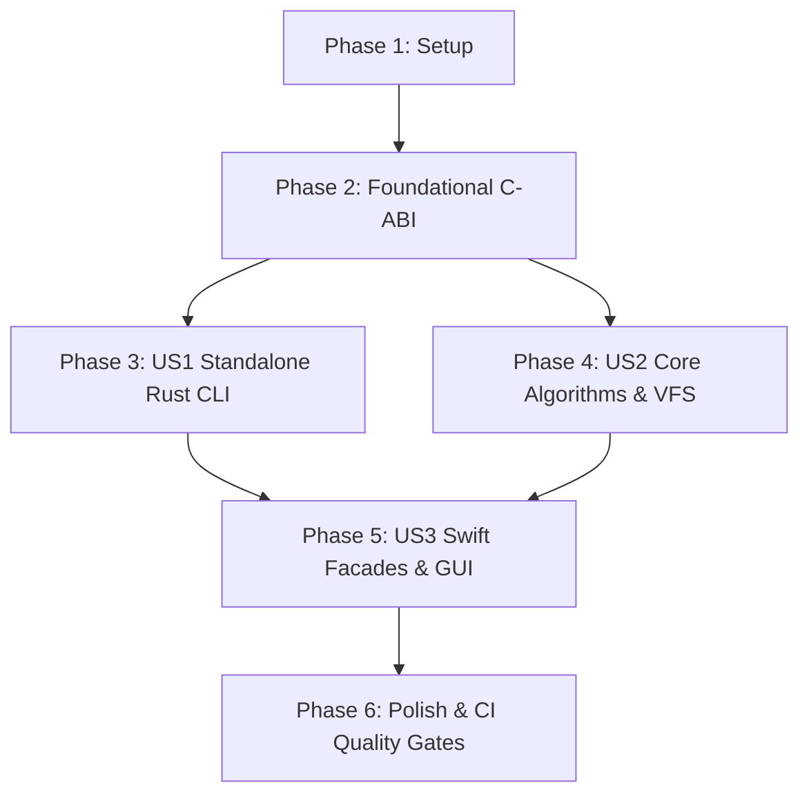

# Tasks: Full Architecture Sinking & Swift-Rust Boundary Execution

**Input**: Design documents from `specs/202-full-architecture-sinking/`
**Prerequisites**: `plan.md`, `spec.md`, `research.md`, `data-model.md`, `contracts/`

---

## Phase 1: Setup (Shared Infrastructure & Environment)

**Purpose**: Project initialization and workspace verification

- [x] T001 Verify Rust workspace configuration and crate dependencies in `rust/Cargo.toml`
- [x] T002 [P] Verify SwiftPM module manifests and linker flags in `Package.swift`
- [x] T003 [P] Verify local quality gate scripts and executable permissions in `scripts/run_local_ci_gate.sh`

---

## Phase 2: Foundational (C-ABI & Shared Contracts)

**Purpose**: Core ABI contracts and build pipeline prerequisites

- [x] T004 Validate C-ABI struct layouts and alignment against `specs/202-full-architecture-sinking/contracts/rust_swift_c_abi.h`
- [x] T005 [P] Verify JSON output schema validation in `specs/202-full-architecture-sinking/contracts/cli_engine_contract.schema.json`
- [x] T006 [P] Ensure panic hooks and unhandled error boundary isolation in `rust/ttzip-glue/src/ffi/mod.rs`

---

## Phase 3: User Story 1 - Standalone Rust CLI & 18 Subcommands (Priority: P1) 🎯 MVP

**Goal**: Deliver standalone `ttzip` binary with complete 18-subcommand parity, sub-5ms cold startup, and `--json` structured output.
**Independent Test**: Execute all 18 CLI subcommands (`list`, `extract`, `create`, `cat`, `check`, `comment`, `convert`, `delete`, `diff`, `hash`, `info`, `lock`, `tree`, `update`, `recover`, `repair`, `split`, `join`, `bench`, `doctor`) with valid inputs and verify standard POSIX exit codes and JSON outputs.

### Implementation for User Story 1

- [x] T007 [P] [US1] Verify CLI argument definitions and `clap` parser in `rust/ttzip-tui/src/cli/args.rs`
- [x] T008 [P] [US1] Implement and verify standard inspection handlers (`list`, `info`, `check`, `hash`, `tree`, `diff`, `cat`) in `rust/ttzip-tui/src/cli/handlers/`
- [x] T009 [P] [US1] Implement and verify mutation and packaging handlers (`create`, `extract`, `update`, `delete`, `convert`, `lock`, `comment`) in `rust/ttzip-tui/src/cli/handlers/`
- [x] T010 [P] [US1] Implement and verify recovery, split, and diagnostic handlers (`recover`, `repair`, `split`, `join`, `bench`, `doctor`) in `rust/ttzip-tui/src/cli/handlers/`
- [x] T011 [US1] Wire all subcommands to router and verify structured output formatting in `rust/ttzip-tui/src/cli/mod.rs`
- [x] T012 [US1] Verify standalone release compilation and binary execution in `rust/target/release/ttzip`

---

## Phase 4: User Story 2 - Core Algorithmic & VFS Memory Sinking (Priority: P2)

**Goal**: Offload CPU/SIMD intensive computations and in-memory directory page management to Rust core.
**Independent Test**: Benchmark CRC64 PMULL throughput, Reed-Solomon Cauchy recovery, and 100k-node VFS tree traversal in Rust unit and integration tests.

### Implementation for User Story 2

- [x] T013 [P] [US2] Verify ARM64 PMULL / NEON hardware acceleration for CRC64, CRC32, and Adler32 in `rust/ttzip-glue/src/crypto/`
- [x] T014 [P] [US2] Verify Galois Field matrix calculation and Cauchy Reed-Solomon FEC in `rust/ttzip-glue/src/security/`
- [x] T015 [P] [US2] Verify virtual file system tree and LZ4 memory block cache pool in `rust/ttzip-glue/src/vfs/`
- [x] T016 [P] [US2] Verify zip extra field and binary header signature scanners in `rust/ttzip-glue/src/archive/`
- [x] T017 [US2] Run full Rust workspace test suite via `cargo test --workspace`

---

## Phase 5: User Story 3 - Swift Thin Facades & macOS GUI Preservation (Priority: P3)

**Goal**: Maintain 100% native Swift GUI and thin facades delegating to Rust C-ABI with zero user-facing regressions.
**Independent Test**: Run Swift test suite (`swift test`), verifying all facades delegate cleanly and GUI view models receive 60fps throttled events.

### Implementation for User Story 3

- [x] T018 [P] [US3] Verify thin delegation in `Sources/TTZipCore/Bridge/ArchiveEngineBridge.swift` and `RustVfsBridge.swift`
- [x] T019 [P] [US3] Verify engine facade routing in `Sources/TTZipCore/Facades/TTZipEngineFacade.swift`
- [x] T020 [P] [US3] Verify Swift CLI entry points in `Sources/TTZipCLI/` seamlessly delegate to core engine
- [x] T021 [US3] Confirm 100% of 144 GUI files in `Sources/TTZipApp/` remain native Swift without regression
- [x] T022 [US3] Run full Swift test suite via `swift test`

---

## Phase 6: Polish & Comprehensive CI Quality Gates

**Purpose**: Cross-cutting repository validation and gate enforcement

- [x] T023 [P] Execute line-of-code gate via `./scripts/lint_loc_gate.sh` (enforcing $\le 800\text{ LOC}$ per file)
- [x] T024 [P] Execute codebase invariants linter via `./scripts/lint_codebase_invariants.sh`
- [x] T025 Execute full 4-stage automated gate via `./scripts/run_local_ci_gate.sh`

---

## Dependencies & Execution Order

---

## Implementation Strategy & Tracking

- **Milestone Check-Off ("完成一个标记一个")**: Each task completed will be explicitly validated, executed, and ticked off in `tasks.md`.
- **MVP Scope**: Phase 1 + Phase 2 + Phase 3 (Standalone Rust CLI with 18 subcommands).
- **Full Scope**: Completion of all 25 tasks across Phases 1 through 6, fully satisfying all 373-file architectural sinking decisions and constitution invariants.
