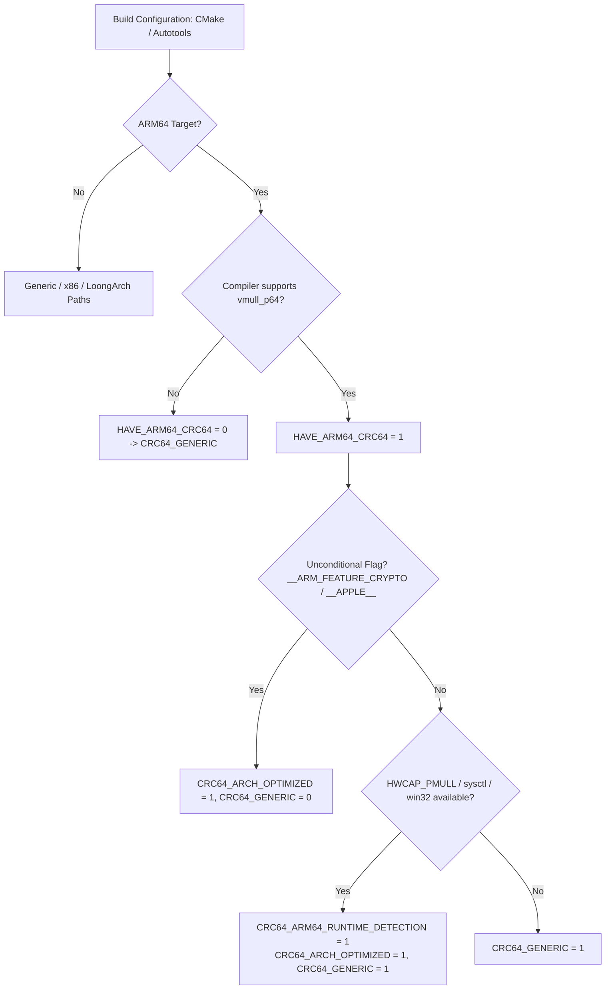

# Data & Configuration Model: XZ PR #241 Remediation

**Feature**: `specs/214-xz-arm64-crc64-remediation`  
**Scope**: Build-time Macros, Dynamic Capabilities, and Vector Register States

---

## 1. Build-Time Macro Invariants

---

## 2. Configuration Entities & Bitflags

| Entity / Symbol | Source Header / File | Invariant / Validation Rule |
| :--- | :--- | :--- |
| `HAVE_ARM64_CRC64` | `config.h` (Autotools / CMake) | Defined if compiler links `vmull_p64` with `+crypto` |
| `HAVE_HWCAP_PMULL` | `<sys/auxv.h>` (Linux / FreeBSD) | Defined if `HWCAP_PMULL` is declared in system headers |
| `CRC64_ARM64_RUNTIME_DETECTION` | `crc_common.h` | Set to 1 if OS provides valid PMULL capability detection |
| `CRC64_ARCH_OPTIMIZED` | `crc_common.h` | Set to 1 if PMULL version is compiled (static or dynamic) |
| `CRC64_GENERIC` | `crc_common.h` | Set to 1 if generic fallback table/function is compiled |
| `vmasks` (64 bytes) | `crc64_arm64.h` | `alignas(64)` constant byte array for unaligned vector permute |

---

## 3. Mathematical Vector Register State Transitions

1. **Folding Phase ($N \ge 64$ bytes)**:
   $$\mathbf{v}_i^{(t+1)} = \text{clmul\_00}(\mathbf{v}_i^{(t)}, \text{fold512}) \oplus \text{clmul\_11}(\mathbf{v}_i^{(t)}, \text{fold512}) \oplus \text{load128}(\text{buf} + 16i)$$
2. **Intermediate Reduction Phase ($64 \to 16$ bytes)**:
   $$\mathbf{v}_0 = \mathbf{v}_1 \oplus \text{fold}(\mathbf{v}_0, \text{fold128}) \oplus \dots$$
3. **Barrett Reduction Phase ($128 \to 64$ bits)**:
   $$\mathbf{v}_1 = \text{clmul\_10}(\mathbf{v}_0, \mu_p), \quad \mathbf{v}_2 = \text{shift\_left\_8}(\mathbf{v}_1)$$
   $$\mathbf{v}_1 = \text{clmul\_00}(\mathbf{v}_1, \mu_p), \quad \mathbf{v}_0 = \mathbf{v}_0 \oplus \mathbf{v}_2 \oplus \mathbf{v}_1$$
   $$\text{CRC64} = \sim \text{extract\_lane\_1}(\mathbf{v}_0)$$
