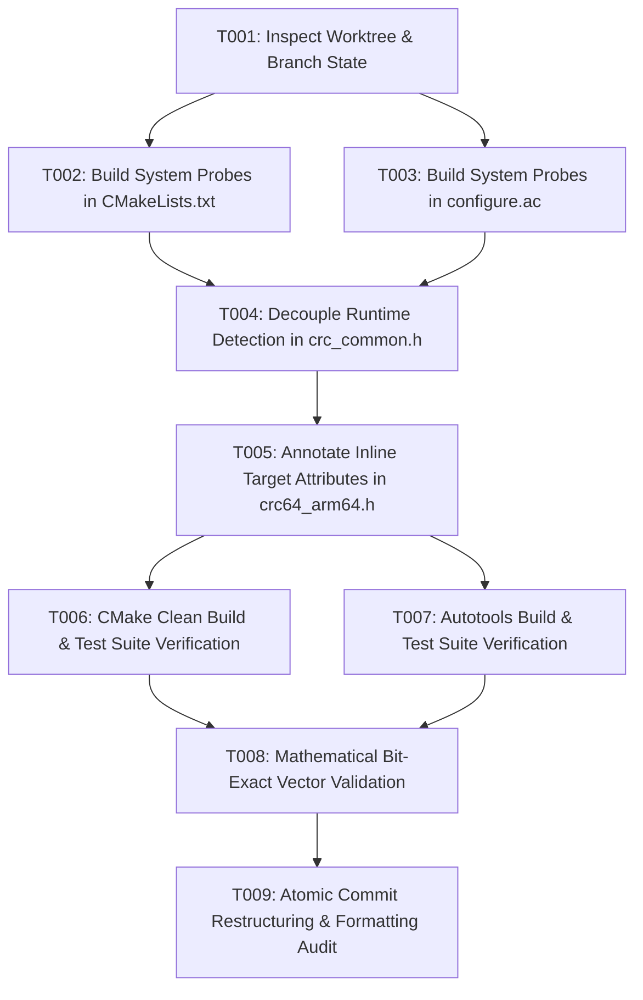

# Tasks: XZ PR #241 ARM64 CRC64 PMULL Remediation

**Feature Directory**: `specs/214-xz-arm64-crc64-remediation`  
**Target Repository**: `Vendor/worktrees/xz/pr2-arm64-crc64`  
**Status**: Completed

---

## Dependencies & User Story Flow

---

## Phase 1: Setup & Environment Validation

- [x] T001 Verify clean worktree status and git branch baseline at `Vendor/worktrees/xz/pr2-arm64-crc64`

---

## Phase 2: Foundational Build System Probes (User Story 1 & 2)

- [x] T002 [P] [US2] Add `XZ_ARM64_CRC64` option, `check_c_source_compiles` compiler probe for `vmull_p64`, and `HWCAP_PMULL` symbol probe in `Vendor/worktrees/xz/pr2-arm64-crc64/CMakeLists.txt`
- [x] T003 [P] [US2] Add `--disable-arm64-crc64` argument, `AC_LINK_IFELSE` compiler probe for `vmull_p64`, and `AC_CHECK_DECL([HWCAP_PMULL])` in `Vendor/worktrees/xz/pr2-arm64-crc64/configure.ac`

---

## Phase 3: User Story 1 - Linux ARM64 Clean Compilation & Runtime Fallback

- [x] T004 [US1] Decouple `CRC32_ARM64_RUNTIME_DETECTION` and `CRC64_ARM64_RUNTIME_DETECTION` with `HAVE_HWCAP_PMULL` guards in `Vendor/worktrees/xz/pr2-arm64-crc64/src/liblzma/check/crc_common.h`

---

## Phase 4: User Story 3 - Compiler Inlining & Target Attribute Hardening

- [x] T005 [US3] Decorate all static inline helper functions (`keep_high_bytes`, `shift_left`, `shift_right`, `clmul_00`, `clmul_10`, `clmul_11`, `fold`, `fold_xor`) with `crc64_attr_target` in `Vendor/worktrees/xz/pr2-arm64-crc64/src/liblzma/check/crc64_arm64.h`

---

## Phase 5: User Story 4 - Bit-Exact Validation & Test Suites

- [x] T006 [P] [US4] Execute CMake build and full test suite (`ctest --output-on-failure`) in `Vendor/worktrees/xz/pr2-arm64-crc64`
- [x] T007 [P] [US4] Execute Autotools build (`./autogen.sh && ./configure && make check`) in `Vendor/worktrees/xz/pr2-arm64-crc64`
- [x] T008 [US4] Verify mathematical bit-exact parity across edge case buffer lengths and alignments via `test_check` in `Vendor/worktrees/xz/pr2-arm64-crc64`

---

## Phase 6: Polish & Commit Organization

- [x] T009 Reorganize commits cleanly on branch `feat/arm64-crc64-clmul` with atomic separation and upstream-compliant commit messages
