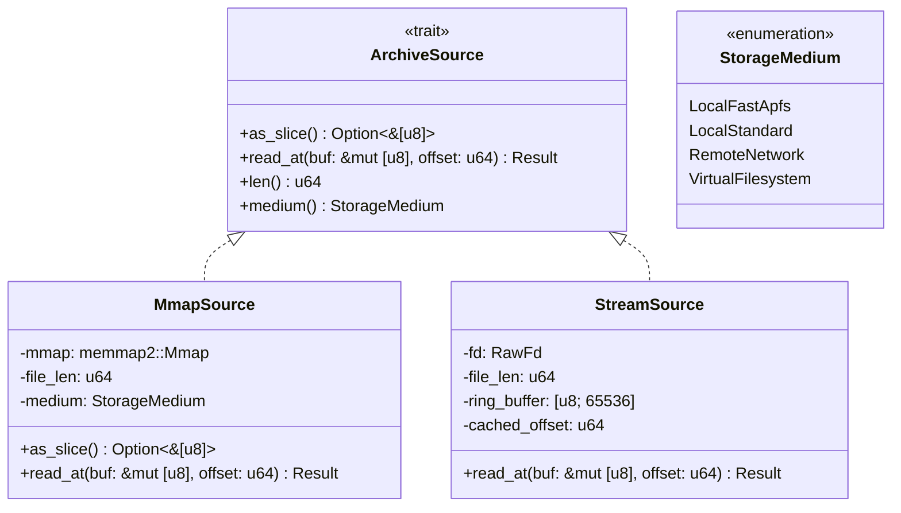

# Data Model & Memory Layout: Rust Core & Glue Layer Architectural Reconstruction

**Feature**: `223-rust-core-and-glue-architectural-reconstruction`  
**Date**: 2026-08-24  
**Spec Reference**: [`spec.md`](file:///Users/kevintung/Documents/dev/TTZip/core/specs/223-rust-core-and-glue-architectural-reconstruction/spec.md)

---

## 1. Core Abstractions & Data Structures



---

## 2. Thread-Local Diagnostic Error Storage

```rust
#[repr(C)]
#[derive(Debug, Clone)]
pub struct DiagnosticErrorContext {
    pub status: TTZipStatus,
    pub message: [u8; 512],
    pub entry_path: [u8; 256],
    pub offset: u64,
    pub timestamp_epoch_ms: u64,
}

impl DiagnosticErrorContext {
    pub const fn empty() -> Self {
        Self {
            status: TTZipStatus::Ok,
            message: [0u8; 512],
            entry_path: [0u8; 256],
            offset: 0,
            timestamp_epoch_ms: 0,
        }
    }

    pub fn set(&mut self, status: TTZipStatus, msg: &str, entry: Option<&str>, offset: u64) {
        self.status = status;
        self.offset = offset;
        self.message.fill(0);
        let msg_bytes = msg.as_bytes();
        let copy_len = msg_bytes.len().min(511);
        self.message[..copy_len].copy_from_slice(&msg_bytes[..copy_len]);

        self.entry_path.fill(0);
        if let Some(e) = entry {
            let e_bytes = e.as_bytes();
            let e_len = e_bytes.len().min(255);
            self.entry_path[..e_len].copy_from_slice(&e_bytes[..e_len]);
        }
    }

    pub fn as_c_str(&self) -> *const libc::c_char {
        if self.status == TTZipStatus::Ok || self.message[0] == 0 {
            std::ptr::null()
        } else {
            self.message.as_ptr() as *const libc::c_char
        }
    }
}
```

---

## 3. Streaming Parallel ZIP Writer Memory Layout

```rust
/// Individual file compression task plan.
pub struct ZipTaskPlan {
    pub file_index: usize,
    pub abs_path: PathBuf,
    pub rel_path: String,
    pub uncompressed_size: u64,
    pub mtime_epoch_secs: u32,
    pub mode: u32,
    pub is_directory: bool,
    pub is_symlink: bool,
    pub symlink_target: Option<String>,
}

/// Compressed block payload ready for atomic positional write (pwrite).
pub struct ZipCompressedBlock {
    pub file_index: usize,
    pub lfh_offset: u64,
    pub compressed_size: u64,
    pub uncompressed_size: u64,
    pub crc32: u32,
    pub compression_method: u16,
    pub header_bytes: Vec<u8>,
    pub compressed_payload: Vec<u8>,
}

/// Summary emitted to the Central Directory.
pub struct ZipCentralDirectoryEntry {
    pub rel_path: String,
    pub lfh_offset: u64,
    pub uncompressed_size: u64,
    pub compressed_size: u64,
    pub crc32: u32,
    pub compression_method: u16,
    pub mtime_epoch_secs: u32,
    pub mode: u32,
    pub is_directory: bool,
    pub is_zip64: bool,
}
```

---

## 4. VFS Session & Compact Node Identifier

```rust
/// Compact VFS node representation storing string slices in a single contiguous arena.
pub struct CompactVfsNode {
    pub node_id: u32,
    pub parent_id: u32,
    pub name_offset: u32,
    pub name_len: u16,
    pub full_path_offset: u32,
    pub full_path_len: u16,
    pub uncompressed_size: u64,
    pub mode: u32,
    pub is_directory: bool,
}

/// Persistent VFS Session Handle referenced by Swift OpaquePointer.
pub struct VfsSessionHandle {
    pub string_arena: Vec<u8>,
    pub nodes: Vec<CompactVfsNode>,
    pub root_id: u32,
}
```

---

## 5. In-Place Archive Mutation Journal & Shadow Context

```rust
pub enum InPlaceAction {
    Append { entry_path: String, source_path: PathBuf },
    Replace { entry_path: String, source_path: PathBuf },
    Delete { entry_path: String },
}

pub struct InPlaceArchiveSession {
    pub archive_path: PathBuf,
    pub shadow_path: PathBuf,
    pub format: TTZipArchiveFormat,
    pub is_solid_7z: bool,
    pub actions: Vec<InPlaceAction>,
    pub committed: bool,
}
```
