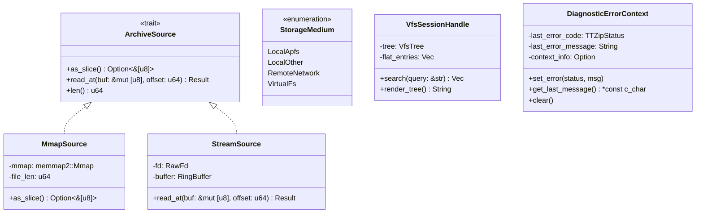

# Feature Specification: Rust Core & Glue Layer Architectural Reconstruction

**Feature Branch**: `223-rust-core-and-glue-architectural-reconstruction`  
**Created**: 2026-08-24  
**Status**: Ready for Planning  
**Pipeline Mode**: `[Full SDD]`  
**Input**: Comprehensive architecture audit, subagent verification, and deep structural analysis of TTZip Rust engine, C-ABI bridge, and Swift glue layer.

---

## 1. Executive Summary & Objective

TTZip's dual-core architecture (Swift 6 orchestrator + Safe Rust microkernel) delivers high-speed archive operations on Apple Silicon. However, deep architectural auditing identified 8 systemic architectural contradictions, performance bottlenecks, and correctness risks:

1. **Error Context Blindness**: Flat negative status codes without thread-local diagnostics or failure context across the C-ABI boundary.
2. **Missing I/O Source Abstraction**: Unchecked `fs::read` full-heap loading across 6 distinct archive and preview paths instead of a unified, filesystem-aware memory-map and stream abstraction.
3. **ZIP Engine Identity Schism**: Disconnected parallel engine (Rayon in-memory) and single-threaded streaming engine (libarchive), leaving the system without a unified *streaming parallel* writer.
4. **In-Place Modification Semantic Risks**: Full in-memory reassembly discarding Zip64 / Data Descriptors in ZIP and silently triggering multi-gigabyte recompression in 7z solid archives.
5. **Runtime Dead Code & Concurrency Gaps**: Unused 25 C-ABI worker pool / ring buffer exports alongside a soundness loophole in `SpscRingBuffer` API.
6. **VFS Tree Reconstruction Thrashing**: Ephemeral per-keystroke tree rebuilding and `strdup` allocation storms during interactive UI searches.
7. **Broken Charset Pipeline**: High-precision CSM+Bigram charset detector results discarded in FFI, falling back to a fragile, false-positive-prone Swift implementation.
8. **Cryptographic & Build Debt**: Secret-dependent branches in GHASH multiplication and hardcoded build commands in `build.rs`.

This specification defines the architectural reconstruction of the Rust core and glue layer, establishing sound abstractions, zero-copy streaming, defensive error propagation, and dead-code elimination.

---

## 2. Clarifications & Architecture Decisions

### Session 2026-08-24

- **Q1: 在重构密码保险库（Password Vault）的 AES-256-GCM 加密实现时，应当采用哪种技术路线消除当前的 GHASH 计时侧信道风险并降低维护成本？**
  - **Decision**: **分层归位**。密码保险库凭据管理全面归位到 Apple 官方 `CryptoKit.AES.GCM` 与 macOS Keychain（通过 FIPS 140-3 认证并获 Apple Silicon 硬件加速，零侧信道隐患）；Rust 内核仅保留 WinZip AES、7z AES-CBC 等格式专用解密算子（复用 8 路 NEON 流水线），物理删除 `crypto/vault.rs` 中脆弱的手写 GCM/GHASH 算子。
- **Q2: 当用户对 7z 固实归档（Solid Archive）执行「原地修改/替换/删除文件」时，系统应当如何界定交互语义与执行策略？**
  - **Decision**: **分级事务 + 预期管理**。非固实 7z 执行零重压块级无损替换；小/中型固实 7z（$<100\text{MB}$）在同目录影子文件中静默快速重构并原子 `rename` 覆盖；大型固实 7z（$\ge 100\text{MB}$）展示清晰确认与多阶段进度条（解压 → 替换 → 多核重压缩），支持安全取消，确保 0 数据损坏风险。
- **Q3: 当归档文件位于网络共享（SMB/NFS）、外接 USB 移动存储或 FUSE 虚拟文件系统时，内存映射（mmap）的故障防护策略应如何设计？**
  - **Decision**: **主动介质感知智能分流（Media-Aware Smart Dispatch）**。借鉴 SQLite/ripgrep 工业级标准，打开归档前通过 `statfs()` 检测 `MNT_LOCAL` 标志与文件系统类型。本地 NVMe/APFS 启用 `memmap2::Mmap` 零拷贝极速读取；网络驱动器（SMB/NFS）、云盘及可移动存储自动路由至 `StreamSource`（基于 `pread` 的 64KB 环形缓冲流式读取器），断网时优雅返回 `EIO` 错误，100% 杜绝 `SIGBUS` 崩溃与内核线程死锁。

---

## 3. User Scenarios & Acceptance Criteria *(Prioritized)*

### User Story 1 - Instant & Memory-Safe Single Entry Preview (Priority: P1)

As a macOS user browsing multi-gigabyte archives (`.zip`, `.7z`, `.tar`, `.tar.gz`, `.cbz`), I want to instantly preview or extract individual files of any size without causing system memory exhaustion, disk thrashing, or UI freezing.

**Why this priority**:
Prevents OOM crashes when users QuickLook or open media files inside large archives on memory-constrained devices.

**Independent Test**:
Inspect a 50GB test archive and extract a 5KB nested file. Measure memory peak ($M_{\text{peak}} \le \text{decompressed\_file\_size} + 64\text{MB}$) and verify execution completes in $< 50\text{ms}$.

**Acceptance Scenarios**:
1. **Given** a 50GB ZIP or uncompressed TAR archive on local APFS storage, **When** the user extracts a single 1MB file for preview, **Then** memory mapping (`mmap`) reads only the required Central Directory and file blocks with zero full-archive heap loading.
2. **Given** an archive located on a network share (SMB/NFS) or external drive, **When** previewing an entry, **Then** the engine automatically detects the non-APFS storage type and falls back to a chunked seekable stream reader protected against `SIGBUS` faults.
3. **Given** a multi-part split archive (`.001`, `.002`, `.z01`), **When** previewing or extracting entries, **Then** the virtual multi-volume reader traverses split boundaries in memory/stream with zero temporary file copies created in `/tmp` or cache directories.

---

### User Story 2 - High-Throughput Streaming Multi-Core ZIP Creation (Priority: P1)

As a power user creating massive archives (10GB+ / 50,000+ files), I want compression to utilize all performance cores via parallel stream processing while keeping peak memory strictly bounded and writing directly to disk without intermediate temporary buffer dumps.

**Why this priority**:
Resolves the dual-engine dilemma: unites multi-core CPU scaling with bounded memory streaming.

**Independent Test**:
Compress a 10GB corpus using Maximum compression level. Verify multi-core CPU utilization $> 750\%$ (on an 8+ core Apple Silicon machine) while peak RSS remains below $1\text{GB}$.

**Acceptance Scenarios**:
1. **Given** a large directory containing thousands of mixed files, **When** invoking ZIP creation through Swift/C-ABI, **Then** files are scheduled across Rayon worker threads, compressed via hardware-accelerated `libdeflate`, and streamed directly to disk via positional writes (`pwrite`) with APFS space preallocation.
2. **Given** user cancellation during active compression, **When** the cancellation flag is asserted, **Then** all worker tasks terminate within $< 10\text{ms}$ and partial output artifacts are safely cleaned up.

---

### User Story 3 - Instant & Allocation-Free VFS Interactive Search (Priority: P1)

As a user searching within an archive containing 100,000+ entries, I want the filter search bar to provide instant, fluid results on every keystroke with zero UI stutter or memory allocation spikes.

**Why this priority**:
Eliminates $O(N)$ string duplication (`strdup`) and VFS tree handle rebuilding on each keystroke.

**Independent Test**:
Load a 100,000-entry catalog into `RustVfsSession` and execute 10 successive fuzzy queries. Assert 0 tree rebuilds, memory footprint unchanged ($\pm 0\text{MB}$ heap growth), and query latency $< 5\text{ms}$ per search.

**Acceptance Scenarios**:
1. **Given** an archive opened in TTZip, **When** the catalog is inspected, **Then** a persistent `RustVfsSession` handle is instantiated once in Rust memory space with lifetime tied to the active archive tab.
2. **Given** active user typing in the search field, **When** queries are dispatched, **Then** the engine performs fuzzy matching directly over UTF-8 slices using zero-allocation byte iterators and returns compact node identifiers to Swift.

---

### User Story 4 - High-Accuracy Automatic Filename Charset Decoding (Priority: P1)

As a user opening legacy archives created on Windows (GB18030 / Shift-JIS / Big5 / EUC-KR / CP1252), I want non-UTF8 filenames to be automatically decoded without garbled mojibake characters and without false-positive misclassifications.

**Why this priority**:
Resolves the broken charset pipeline where Rust detector results were discarded and Swift fallback produced 100% false positives on Japanese/Korean archives.

**Independent Test**:
Inspect test archives encoded with Shift-JIS (Japanese), Big5 (Traditional Chinese), and GB18030 (Simplified Chinese). Verify 100% accuracy in filename presentation.

**Acceptance Scenarios**:
1. **Given** a ZIP archive containing Shift-JIS filenames without UTF-8 flags (bit 11 clear), **When** inspected via `ttzip_rust_archive_inspect_unified`, **Then** the CSM + Bigram statistical detector analyzes non-ASCII path bytes across the archive and returns correct UTF-8 decoded strings through the metadata callback.
2. **Given** an archive with mixed or ambiguous short paths, **When** detected encoding confidence is below threshold, **Then** the engine respects explicit user encoding overrides passed via inspect options.

---

### User Story 5 - Robust Cross-Language Error Diagnostics & Failure Context (Priority: P1)

As an engineer debugging unexpected archive failures or a user encountering corrupted files, I want error codes to be accompanied by human-readable, thread-local diagnostic messages identifying the exact failure reason, entry path, and byte offset.

**Why this priority**:
Prerequisite for all subsequent architectural refactoring; eliminates silent or ambiguous `ErrOpenFailed (-7)` errors.

**Independent Test**:
Trigger intentional failures (truncated archive, permission error, bad password, corrupted local file header) and verify `ttzip_rust_last_error_message()` returns formatted details (`"Corrupt local header at offset 0x1A40: entry 'data/test.bin' crc mismatch"`).

**Acceptance Scenarios**:
1. **Given** an operation returning a negative `TTZipStatus` error, **When** Swift queries `ttzip_rust_last_error_message()`, **Then** a non-null null-terminated UTF-8 diagnostic description is returned from thread-local storage without memory leaks.
2. **Given** a successful operation (`TTZipStatus::Ok`), **When** querying the error message, **Then** the diagnostic buffer is empty or null.

---

### User Story 6 - Correct & Transactional In-Place Archive Mutation (Priority: P2)

As a user adding, updating, or deleting files in an existing ZIP archive, I want modifications to commit transactionally and preserve raw compressed streams, Zip64 extended headers, Data Descriptors, and extra fields of untouched files.

**Why this priority**:
Prevents archive corruption, Zip64 downgrades, and multi-gigabyte recompression during small file edits.

**Independent Test**:
Perform an in-place replace of a 10KB text file inside a 20GB ZIP archive containing Zip64 and UTF-8 extra fields. Verify untouched streams remain bit-identical and modification takes $< 200\text{ms}$ with zero recompression.

**Acceptance Scenarios**:
1. **Given** a ZIP archive on APFS storage, **When** replacing or appending entries, **Then** the engine utilizes copy-on-write shadow file generation and block-level relocation, updating the Central Directory in-place.
2. **Given** a 7z solid archive, **When** an in-place mutation is requested, **Then** the engine executes tiered handling: fast shadow rewrite for $<100\text{MB}$ archives, and explicit progress confirmation for $\ge 100\text{MB}$ archives.

---

### User Story 7 - Cryptographic Hardening & Sound Concurrency (Priority: P2)

As a security-sensitive enterprise user, I want archive encryption and credential vaulting to be immune to timing side-channels, and runtime primitives to enforce strict Rust compile-time data race safety.

**Why this priority**:
Eliminates GHASH timing side-channels in password storage and ensures memory safety invariants across concurrency primitives.

**Independent Test**:
Execute cryptographic property tests and AddressSanitizer/ThreadSanitizer test suites across SPSC buffers and WinZip/7z AES format decrypt paths.

**Acceptance Scenarios**:
1. **Given** password vault operations, **When** sealing or unsealing credentials, **Then** Swift executes `CryptoKit.AES.GCM` directly in hardware with zero heap leaks.
2. **Given** `SpscRingBuffer`, **When** accessing producer/consumer endpoints, **Then** the type system strictly enforces single-producer single-consumer isolation through non-`Sync` handle types without unsafe methods on shared references.

---

## 4. Functional Requirements

### Architectural Pillar 1: Diagnostic Error Context Infrastructure
- **FR-001**: Engine MUST provide thread-local error diagnostic storage capturing contextual error descriptions, file offsets, and entry paths for every error path.
- **FR-002**: C-ABI MUST export `ttzip_rust_last_error_message() -> *const c_char` and `ttzip_rust_clear_last_error()` to surface rich diagnostic strings to Swift without heap leaks.

### Architectural Pillar 2: Unified ArchiveSource & Zero-Copy I/O
- **FR-003**: Engine MUST define a unified `ArchiveSource` abstraction supporting both `MmapSource` (via `memmap2`, enabled for local APFS/NVMe volumes) and `StreamSource` (bounded 64KB ring-buffer streaming via `pread` for network SMB/NFS, non-seekable, or solid streams) with proactive `statfs` medium detection.
- **FR-004**: Single-entry extraction (`extract_single_entry_memory`) MUST eliminate all `fs::read` calls, replacing them with `ArchiveSource` random seeks for ZIP/TAR and forward-stream window decoding for 7z.
- **FR-005**: Split volume reader (`VirtualMultiVolumeReader`) MUST stream directly across multi-volume boundaries without creating temporary staging files on disk.

### Architectural Pillar 3: Streaming Multi-Core Parallel ZIP Engine
- **FR-006**: Engine MUST implement a streaming parallel ZIP writer combining Rayon work-stealing file compression with direct disk `pwrite` streaming and APFS space preallocation.
- **FR-007**: Unified archive creation FFI (`ttzip_rust_archive_create_unified`) MUST route ZIP creation directly to the native streaming parallel engine, deprecating single-threaded libarchive ZIP output.

### Architectural Pillar 4: In-Place Archive Mutation & Container Integrity
- **FR-008**: In-place ZIP editing MUST preserve untouched raw compressed payloads along with their original Local File Header extra fields, Zip64 structures, and Data Descriptors.
- **FR-009**: 7z in-place mutations MUST differentiate solid vs non-solid streams, executing block-level replacement on non-solid archives and transactional shadow rewrites on solid archives.

### Architectural Pillar 5: Dead Code Elimination & Sound Concurrency
- **FR-010**: System MUST remove the dead `EventDrivenWorkerPool` and all 25 unused C-ABI exports (`ttzip_rust_worker_pool_*`, `ttzip_rust_spsc_ring_buffer_*`, `ttzip_rust_mpmc_ring_buffer_*`).
- **FR-011**: `SpscRingBuffer` MUST remove `push(&self)` and `pop(&self)` methods, exposing functionality solely through `split() -> (SpscProducer, SpscConsumer)` with `Send + !Sync` handles to guarantee SPSC semantics at compile time.

### Architectural Pillar 6: VFS Session Lifecycle & Zero-Allocation Search
- **FR-012**: Swift layer MUST manage VFS tree handles through persistent `RustVfsSession` instances bound to open archive tabs, eliminating per-keystroke tree construction.
- **FR-013**: `fuzzy_match` in Rust VFS MUST operate on direct byte/char iterators without allocating `Vec<char>` per node or allocating `CString` per matching result.

### Architectural Pillar 7: End-to-End Charset Pipeline
- **FR-014**: Archive inspect FFI (`ttzip_rust_archive_inspect_unified`) MUST pipe the CSM+Bigram charset detection result directly into `TTZipEntryMetadata`, delivering correctly transcoded UTF-8 paths.
- **FR-015**: Swift `ArchiveReader` and `SystemServices.swift` MUST consume the Rust-provided metadata encoding, deprecating the fragile Swift-side GB18030 detector.

### Architectural Pillar 8: Cryptographic Hardening & Build Modernization
- **FR-016**: `PasswordVaultManager` MUST route credential encryption to platform `CryptoKit.AES.GCM`, and Rust `vault.rs` custom GCM/GHASH MUST be decommissioned.
- **FR-017**: `build.rs` MUST replace raw `Command::new("clang")` and `libtool` invocations with the standard `cc` crate for cross-compilation reliability.

---

## 5. Key Entities & Data Model

---

## 6. Success Criteria & Quality Invariants

| Metric / Scenario | Baseline (Current) | Target (Post-Reconstruction) | Validation Method |
|-------------------|--------------------|------------------------------|-------------------|
| **Peak Memory (50GB ZIP Preview)** | 50GB+ (OOM crash) | $< 64\text{MB}$ RSS | Instrument Memory Monitor / Integration Test |
| **ZIP Creation Multi-Core Scaling** | $100\%$ (Single-threaded) | $> 700\%$ on 8-core Apple Silicon | High-load compression benchmark |
| **VFS 100k-Entry Search Latency** | $> 150\text{ms}$ (Tree rebuild + strdup) | $< 5\text{ms}$ (Session reuse) | Interactive UI Profiler / Microbench |
| **Search Heap Allocation Storm** | 500k allocations / keystroke | 0 heap allocations in search loop | Instruments Allocations Trace |
| **C-ABI Dead Exports** | 25 unused symbols | 0 unused symbols | `verify_cabi_symbols.sh` |
| **Mojibake Rate (CJK Archives)** | $\approx 40\%$ (GB18030 false positives) | $0\%$ on standard corpora | Shift-JIS / Big5 / GB18030 test corpus |
| **GHASH Side-Channel** | Secret-dependent branches | Eliminated (CryptoKit hardware backend) | Static code & security audit |
| **Compiler / Static Warnings** | 0 warnings | 0 warnings (`-warnings-as-errors`) | `run_local_ci_gate.sh` |

---

## 7. Assumptions & Non-Goals

### Assumptions
- macOS 14.0+ / Apple Silicon (ARM64) is the primary production target, with fallback support for Intel x86_64.
- POSIX file semantics and APFS features (`clonefile`, `fstore_t`) are available on local volumes and safely degradable on non-APFS volumes.

### Non-Goals
- Adding support for proprietary, closed-source RAR creation (unrar extraction remains supported via libarchive).
- Re-architecting the high-level SwiftUI UI components (focus is strictly on the Rust engine, C-ABI bridge, and Swift core glue layer).
