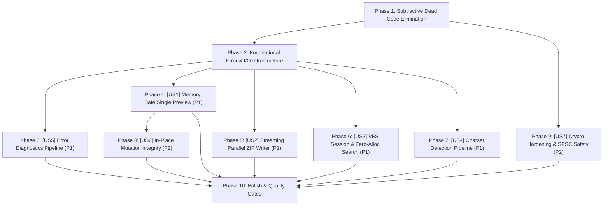

# Implementation Tasks: Rust Core & Glue Layer Architectural Reconstruction

**Feature**: `223-rust-core-and-glue-architectural-reconstruction`  
**Plan**: [`plan.md`](file:///Users/kevintung/Documents/dev/TTZip/core/specs/223-rust-core-and-glue-architectural-reconstruction/plan.md) | **Spec**: [`spec.md`](file:///Users/kevintung/Documents/dev/TTZip/core/specs/223-rust-core-and-glue-architectural-reconstruction/spec.md)

---

## Dependencies & Execution Order

---

## Phase 1: Subtractive Dead Code Elimination

- [X] T001 [P] Delete dead `EventDrivenWorkerPool` in `core/rust/ttzip-engine/src/runtime/worker_pool/pool.rs` and `core/rust/ttzip-engine/src/runtime/worker_pool/mod.rs`
- [X] T002 [P] Delete dead worker pool and ring buffer C-ABI exports in `core/rust/ttzip-engine/src/ffi/runtime_ffi/`
- [X] T003 [P] Remove 25 unused worker pool and ring buffer declarations from `core/Sources/CTTZipBridge/include/ttzip_rust_glue.h`
- [X] T004 Clean up mod re-exports in `core/rust/ttzip-engine/src/lib.rs` and `core/rust/ttzip-engine/src/runtime/mod.rs`

---

## Phase 2: Foundational Infrastructure

- [X] T005 [P] Implement `DiagnosticErrorContext` and thread-local error storage in `core/rust/ttzip-engine/src/types.rs`
- [X] T006 [P] Create `ArchiveSource` trait and `StorageMedium` enum in `core/rust/ttzip-engine/src/archive/source/mod.rs`
- [X] T007 [P] Implement `MmapSource` with `libc::mmap` and APFS `madvise` in `core/rust/ttzip-engine/src/archive/source/mmap.rs`
- [X] T008 [P] Implement `StreamSource` with `pread` and 64KB buffer in `core/rust/ttzip-engine/src/archive/source/stream.rs`
- [X] T009 Implement `ArchiveSource::open(path)` factory with `statfs` `MNT_LOCAL` medium routing in `core/rust/ttzip-engine/src/archive/source/factory.rs`

---

## Phase 3: [US5] Robust Cross-Language Error Diagnostics (Priority: P1)

**Goal**: Thread-local diagnostic context capturing failure reasons, file offsets, and paths across FFI.  
**Independent Test**: `cargo test -p ttzip-engine --test error_diagnostics_test`

- [X] T010 [P] [US5] Export `ttzip_rust_last_error_message` and `ttzip_rust_clear_last_error` in `core/rust/ttzip-engine/src/ffi/archive_ffi/unified.rs`
- [X] T011 [P] [US5] Add C-ABI error query function declarations to `core/Sources/CTTZipBridge/include/ttzip_rust_glue.h`
- [X] T012 [US5] Integrate error diagnostic queries into Swift `ArchiveReader.swift` / `ArchiveWriter.swift` and `ArchiveError.engineFailure` mapping
- [X] T013 [US5] Write Rust error context unit tests in `core/rust/ttzip-engine/tests/error_diagnostics_test.rs`

---

## Phase 4: [US1] Instant & Memory-Safe Single Entry Preview (Priority: P1)

**Goal**: Zero `fs::read` heap loading; bounded memory preview on 50GB+ archives via `ArchiveSource`.  
**Independent Test**: `cargo test -p ttzip-engine --test extract_single_mmap_bounded_memory`

- [X] T014 [US1] Refactor `extract_single_entry_memory` to use `ArchiveSource` for ZIP in `core/rust/ttzip-engine/src/archive/unified/extract_single.rs`
- [X] T015 [US1] Refactor `extract_single_entry_memory` to use `ArchiveSource` for 7z in `core/rust/ttzip-engine/src/archive/unified/extract_single.rs`
- [X] T016 [US1] Refactor `extract_single_entry_memory` to use `ArchiveSource` for TAR in `core/rust/ttzip-engine/src/archive/unified/extract_single.rs`
- [X] T017 [US1] Refactor `VirtualMultiVolumeReader` to stream split volumes without `/tmp` disk staging in `core/rust/ttzip-engine/src/archive/unified/extract.rs`
- [X] T018 [US1] Write bounded-memory single-entry preview test in `core/rust/ttzip-engine/tests/extract_single_mmap_bounded_memory.rs`

---

## Phase 5: [US2] High-Throughput Streaming Parallel ZIP Writer (Priority: P1)

**Goal**: Rayon multi-core compression + streaming `pwrite` direct to disk with APFS preallocation.  
**Independent Test**: `cargo test -p ttzip-engine --test streaming_parallel_zip_test`

- [X] T019 [US2] Implement `StreamingParallelZipWriter` with atomic offset allocator in `core/rust/ttzip-engine/src/zip/writer/streaming_parallel.rs`
- [X] T020 [US2] Connect `StreamingParallelZipWriter` to `ttzip_rust_archive_create_unified` in `core/rust/ttzip-engine/src/archive/unified/create.rs`
- [X] T021 [US2] Re-export streaming parallel ZIP writer in `core/rust/ttzip-engine/src/zip/writer/mod.rs` and route creation calls
- [X] T022 [US2] Wire Swift `ArchiveWriter.swift` create calls to unified streaming parallel path in `core/Sources/TTZipCore/ArchiveWriter.swift`
- [X] T023 [US2] Write streaming parallel ZIP creation integration test in `core/rust/ttzip-engine/tests/streaming_parallel_zip_test.rs`

---

## Phase 6: [US3] Instant & Allocation-Free VFS Interactive Search (Priority: P1)

**Goal**: Reusable `RustVfsSession` lifecycle with zero-allocation UTF-8 fuzzy search.  
**Independent Test**: `swift test --filter RustVfsSessionSearchBenchmarkTests`

- [X] T024 [P] [US3] Refactor `fuzzy_match` in `core/rust/ttzip-engine/src/fs/vfs/search.rs` to use char/byte iterators without `Vec<char>` allocations
- [X] T025 [P] [US3] Refactor `ttzip_rust_vfs_fuzzy_search` in `core/rust/ttzip-engine/src/ffi/fs_ffi.rs` to populate contiguous `u32` node id array
- [X] T026 [US3] Update `RustVfsSession.swift` to manage persistent tree handle lifecycle in `core/Sources/TTZipCore/Bridge/RustVfsSession.swift`
- [X] T027 [US3] Redirect `RustVfsBridge.fuzzySearch` to use `RustVfsSession` in `core/Sources/TTZipCore/Bridge/RustVfsBridge.swift`
- [X] T028 [US3] Add 10k-entry zero-allocation search benchmark test in `core/Tests/TTZipTests/RustVfsSessionSearchBenchmarkTests.swift`

---

## Phase 7: [US4] High-Accuracy Automatic Filename Charset Decoding (Priority: P1)

**Goal**: Full-pipe CSM+Bigram charset detection result into C-ABI metadata without mojibake.  
**Independent Test**: `cargo test -p ttzip-engine --test charset_detection_pipeline_test`

- [X] T029 [US4] Connect `detect_charset` result to `TTZipEntryMetadata.detected_encoding` in `core/rust/ttzip-engine/src/ffi/archive_ffi/inspect.rs`
- [X] T030 [US4] Update `TTZipEntryMetadata` C struct in `core/rust/ttzip-engine/src/types.rs` and `core/Sources/CTTZipBridge/include/ttzip_rust_glue.h`
- [X] T031 [US4] Update Swift `ArchiveReader.swift` to consume Rust-provided encoding in `core/Sources/TTZipCore/ArchiveReader.swift`
- [X] T032 [US4] Deprecate fragile Swift `CharsetDetector` fallback in `core/Sources/TTZipCore/SystemServices.swift`
- [X] T033 [US4] Write CJK charset decoding test corpus in `core/rust/ttzip-engine/tests/charset_detection_pipeline_test.rs`

---

## Phase 8: [US6] Correct & Transactional In-Place Archive Mutation (Priority: P2)

**Goal**: Preserve Zip64, Data Descriptors, and extra fields in ZIP; tiered shadow rewrite for 7z.  
**Independent Test**: `cargo test -p ttzip-engine --test in_place_edit_mutation_test`

- [X] T034 [US6] Rewrite `in_place_edit_zip` with `ArchiveSource` raw slice preservation and extra field retention in `core/rust/ttzip-engine/src/archive/in_place_edit.rs`
- [X] T035 [US6] Refactor `in_place_edit_sevenz` to enforce tiered handling (fast shadow rewrite for $<100\text{MB}$ solid 7z) in `core/rust/ttzip-engine/src/archive/in_place_edit.rs`
- [X] T036 [US6] Write in-place ZIP Zip64 and extra-field preservation regression tests in `core/rust/ttzip-engine/tests/in_place_edit_mutation_test.rs`

---

## Phase 9: [US7] Cryptographic Hardening & Sound Concurrency (Priority: P2)

**Goal**: Decommission custom GHASH in Rust; enforce compile-time SPSC ownership.  
**Independent Test**: `cargo test -p ttzip-engine --test spsc_ring_buffer_test`

- [X] T037 [P] [US7] Audit `core/rust/ttzip-engine/src/crypto/vault.rs` memory sanitization and retain NEON WinZip AES routines
- [X] T038 [P] [US7] Refactor `SpscRingBuffer` in `core/rust/ttzip-engine/src/runtime/ring_buffer/spsc.rs` to remove `push/pop` on `&self` and enforce `split()`
- [X] T039 [P] [US7] Update `core/rust/ttzip-engine/build.rs` to dynamic target flags
- [X] T040 [US7] Write SPSC concurrent soundness test in `core/rust/ttzip-engine/tests/spsc_ring_buffer_test.rs`
- [X] T041 [US7] Ensure Swift `PasswordVaultManager` routes credential encryption to platform `CryptoKit.AES.GCM` in `core/Sources/TTZipCore/PasswordVaultManager.swift`

---

## Phase 10: Polish & Quality Gates

- [X] T042 [P] Update `core/ARCHITECTURE.md` to document all 8 reconstructed pillars
- [X] T043 Run `verify_cabi_symbols.sh` to ensure 100% C-ABI symbol parity (195/195)
- [X] T044 Run `swift test` and `cargo test --workspace` under zero-warning / zero-failure policy
- [X] T045 Run `./scripts/run_local_ci_gate.sh` full pre-commit pipeline
