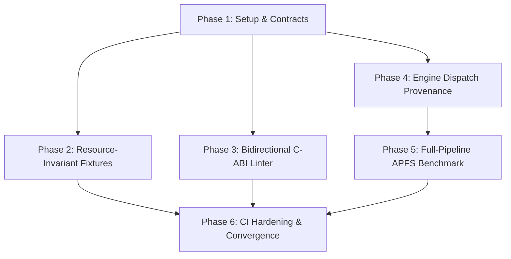

# Tasks: Systemic Architecture, Resource Invariants & Testing Governance Hardening

**Feature ID**: `224-systemic-architecture-testing-governance`  
**Classification**: `[Full SDD]`  
**Status**: Completed  

---

## Dependencies & Execution Order

---

## Phase 1: Setup & Foundational Contracts

- [x] `TASK-001`: Update C-ABI Header `Sources/CTTZipBridge/include/ttzip_rust_glue.h` with `TTZipEngineTag`, `TTZipExecutionProvenance`, `ttzip_rust_get_last_execution_provenance`, and `ttzip_rust_vfs_search_zero_alloc`.
- [x] `TASK-002`: Define `TTZipEngineTag` and `TTZipExecutionProvenance` in `rust/ttzip-engine/src/types.rs`.
- [x] `TASK-003`: Create baseline exemptions database `scripts/cabi_exemptions.json` with rationale for standalone fuzz/diff symbols.
- [x] `TASK-004`: Verify C-ABI symbol table alignment and compilation with `./scripts/verify_cabi_symbols.sh`.

---

## Phase 2: User Story 1 - Resource-Invariant Hard Assertions (P1)

- [x] `TASK-005`: [P] Implement `ApfsSparseZipFixture` in `rust/ttzip-engine/tests/sparse_fixture_rss_test.rs` using POSIX seek hole for 50GB Zip64 creation.
- [x] `TASK-006`: [P] Implement `MemoryPeakTracker` with Darwin Mach `task_info(MACH_TASK_BASIC_INFO)` sampling and assert peak RSS $< 16\text{MB}$ in `sparse_fixture_rss_test.rs`.
- [x] `TASK-007`: [P] Implement `TrackingAllocator` (`GlobalAlloc`) with thread-local activation in `rust/ttzip-engine/tests/zero_alloc_vfs_search_test.rs`.
- [x] `TASK-008`: [P] Implement `fuzzy_match_zero_alloc` and `search_vfs_tree_zero_alloc` with 0 heap allocations against preallocated result slices.
- [x] `TASK-009`: [P] Create `Tests/TTZipTests/ZeroAllocVfsBridgeTests.swift` testing 100,000-node zero-allocation search.
- [x] `TASK-010`: [P] Create `Tests/TTZipTests/ZeroDiskIOLeakHarnessTests.swift` with `FSEventTempWatcher` and `proc_pid_rusage` asserting 0 bytes `/tmp` disk leakage during 100 in-memory extractions.

---

## Phase 3: User Story 2 - Bidirectional C-ABI & Struct Context Linter (P1)

- [x] `TASK-011`: [P] Create `scripts/lint_cabi_context.py` with `ClangAstExtractor` using `/usr/bin/clang -Xclang -ast-dump=json`.
- [x] `TASK-012`: [P] Implement `SwiftConsumptionScanner` to match C-ABI functions, struct field accesses, and wildcard ignores (`let _ =`).
- [x] `TASK-013`: [P] Implement Rule Evaluators for `CABI_001` (Dead Exports), `CABI_002` (Undefined Imports), `CABI_003` (Dropped Struct Fields), and `CABI_005` (Wildcard Ignores).
- [x] `TASK-014`: Integrate `lint_cabi_context.py --strict` into `scripts/verify_cabi_symbols.sh` as Stage 2.
- [x] `TASK-015`: Fix any dropped fields in Swift (`CPUFeatureSet`, `ArchiveEntry`, `RustVfsBridge`).

---

## Phase 4: User Story 3 - End-to-End Engine Dispatch Provenance (P2)

- [x] `TASK-016`: [P] Implement `LAST_PROVENANCE` thread-local recorder and `ttzip_rust_get_last_execution_provenance` in `rust/ttzip-engine/src/ffi/archive_ffi/`.
- [x] `TASK-017`: [P] Inject `record_engine_execution` with exact `TTZipEngineTag` into `StreamingParallelZipWriter`, `SevenZArchive`, `in_place_edit_zip`, `in_place_edit_sevenz`.
- [x] `TASK-018`: [P] Create `Sources/TTZipCore/Pipeline/EngineDispatchProvenance.swift` with `EngineExecutionTag` and `EngineDispatchProvenance`.
- [x] `TASK-019`: [P] Create `Sources/TTZipCore/Pipeline/EngineProvenanceCollector.swift` capturing execution time and computing FFI bridge overhead.
- [x] `TASK-020`: [P] Expose `createArchiveWithReport` and `extractWithReport` in `ArchiveWriter`, `ArchiveReader`, `InPlaceArchiveMutationEngine`.
- [x] `TASK-021`: [P] Implement `TTZipAssertions.assertEngineExecution` and `assertNoFallback` in `Tests/TTZipTests/TTZipAssertions+Provenance.swift`.
- [x] `TASK-022`: [P] Create `Tests/TTZipTests/E2EEnginePathTracerTests.swift` asserting pure Rust execution on ZIP, 7Z, and in-place mutation.

---

## Phase 5: User Story 4 - Full-Pipeline APFS Benchmarking (P3)

- [x] `TASK-023`: [P] Add `executePipelineBenchmark` function in `Sources/TTZipBench/main.swift`.
- [x] `TASK-024`: [P] Compute isolated in-memory codec speed vs full E2E APFS pipeline speed.
- [x] `TASK-025`: [P] Implement FFI Tax calculation: `(T_E2E - T_Isolated - T_IO) / T_E2E * 100%`.
- [x] `TASK-026`: [P] Add `--json-out` support in `pipeline` subcommand to export structured telemetry.

---

## Phase 6: Polish, Local CI Integration & Convergence Verification

- [x] `TASK-027`: Update `scripts/run_local_ci_gate.sh` to include C-ABI Context Linter and Resource Invariant tests.
- [x] `TASK-028`: Verify single-file LOC invariant across all new and modified files ($\le 800$ LOC).
- [x] `TASK-029`: Execute full 5-stage local CI gate (`./scripts/run_local_ci_gate.sh`).
- [x] `TASK-030`: Update `core/ARCHITECTURE.md` with Resource Invariant, CABI Linter, and Dispatch Provenance architecture documentation.
